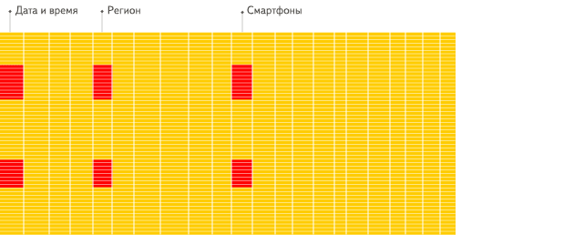

- [ClickHouse介绍](#clickhouse介绍)
  - [OLTP vs OLAP](#oltp-vs-olap)
  - [列式存储](#列式存储)
  - [应用场景](#应用场景)
  - [限制](#限制)
  - [编码压缩](#编码压缩)
  - [向量化执行与SIMD](#向量化执行与simd)
  - [多索引](#多索引)
  - [数据Partitioning](#数据partitioning)
  - [数据TTL](#数据ttl)
  - [有限支持delete、update](#有限支持deleteupdate)
  - [数据类型](#数据类型)
    - [string](#string)
    - [FixedString(N)](#fixedstringn)
    - [Date](#date)
    - [Datetime](#datetime)
    - [Array(t)](#arrayt)
    - [Nullable(typename)](#nullabletypename)
  - [Table Functions](#table-functions)
    - [file(path, format, structure)](#filepath-format-structure)
    - [url(URL, format, structure)](#urlurl-format-structure)
    - [mysql('host:port', 'database', 'table', 'user', 'password'[, replace_query, 'on_duplicate_clause'])](#mysqlhostport-database-table-user-password-replace_query-on_duplicate_clause)
    - [jdbc(jdbc_connection_uri, schema, table)](#jdbcjdbc_connection_uri-schema-table)
    - [input](#input)
    - [generateRandom('name TypeName[, name TypeName]...', [, 'random_seed'[, 'max_string_length'[, 'max_array_length']]])](#generaterandomname-typename-name-typename--random_seed-max_string_length-max_array_length)
    - [numbers](#numbers)
  - [sql语法](#sql语法)
    - [create](#create)
  - [system database](#system-database)
  - [引擎](#引擎)
    - [Log系列](#log系列)
    - [Integration系列](#integration系列)
    - [Special系列](#special系列)
    - [MergeTree系列](#mergetree系列)
      - [MergeTree](#mergetree)
      - [ReplacingMergeTree](#replacingmergetree)
      - [CollapsingMergeTree](#collapsingmergetree)
      - [VersionedCollapsingMergeTree](#versionedcollapsingmergetree)
      - [SummingMergeTree](#summingmergetree)
  - [基本操作](#基本操作)
  - [实操 和postgresql性能对比](#实操-和postgresql性能对比)
    - [postgresql导出数据](#postgresql导出数据)
    - [数据修改](#数据修改)
    - [创建数据表](#创建数据表)
    - [数据导入](#数据导入)
    - [查询性能](#查询性能)
      - [join查询](#join查询)
      - [窗口函数查询](#窗口函数查询)


# ClickHouse介绍
ClickHouse是一个针对OLAP业务的列式数据库

## OLTP vs OLAP

OLTP（on-line transaction processing）在线事务处理，特征：
* OLTP系统的主要是记录事务时的当前更新，插入和删除。 
* OLTP查询更简单，更短，因此需要更少的处理时间，也需要更少的空间。
* OLTP数据库经常更新。
* OLTP中的数据处理可能会在中间失败，这可能会影响数据完整性。因此，它必须特别注意数据完整性。
* OLTP系统成为OLAP的数据源。

OLAP（On-Line Analytical Processing）在线分析处理，特征：
* OLAP数据库存储OLTP输入的历史数据。它允许用户查看多维数据的不同摘要。
* 使用OLAP，可以从大型数据库中提取信息并进行分析以供决策。 
* OLAP允许用户执行复杂的查询以提取多维数据。
* 在OLTP中，即使数据处理在中间失败，也不会损害数据完整性。
* OLAP执行的任务很长，需要花费更多的时间进行处理，并且需要很大的空间。
* 与OLTP相比，OLAP中的事务较少。甚至OLAP数据库中的表也可能不规范。


从字面上来看，OLTP是做事务处理，OLAP是做分析处理
从对数据库操作来看，OLTP主要是对数据的增删改，OLAP是对数据的查询。

OLTP主要用来记录某类业务事件的发生，当行为产生后，系统会记录是谁在何时何地做了何事，这样的一行（或多行）数据会以增删改的方式在数据库中进行数据的更新处理操作，要求实时性高、稳定性强、确保数据及时更新成功，像公司常见的业务系统如ERP，CRM，OA等系统都属于OLTP。

当数据积累到一定的程度，需要对过去发生的事情做一个总结分析时，就需要把过去一段时间内产生的数据拿出来进行统计分析，从中获取我们想要的信息，为做决策提供支持，这时候就是在做OLAP。


## 列式存储

行式存储


列式存储



## 应用场景
1. 绝大多数请求都是用于读访问的
2. 数据需要以大批次（大于1000行）进行更新，而不是单行更新；或者根本没有更新操作
3. 数据只是添加到数据库，没有必要修改
4. 读取数据时，会从数据库中提取出大量的行，但只用到一小部分列
5. 表很“宽”，即表中包含大量的列
6. 查询频率相对较低（通常每台服务器每秒查询数百次或更少）
7. 对于简单查询，允许大约50毫秒的延迟
8. 列的值是比较小的数值和短字符串（例如，每个URL只有60个字节）
9. 在处理单个查询时需要高吞吐量（每台服务器每秒高达数十亿行）
10. 不需要事务
11. 数据一致性要求较低
12. 每次查询中只会查询一个大表。除了一个大表，其余都是小表
13. 查询结果显著小于数据源。即数据有过滤或聚合。返回结果不超过单个服务器内存大小

## 限制
1. 不支持真正的删除/更新支持 不支持事务
2. 不支持二级索引
3. 有限的SQL支持，join实现与众不同
4. 不支持窗口功能
5. 元数据管理需要人工干预维护

## 编码压缩

由于 ClickHouse 采用列存储，相同列的数据连续存储，且底层数据在存储时是经过排序的，这样数据的局部规律性非常强，有利于获得更高的数据压缩比。

此外，ClickHouse 除了支持 LZ4、ZSTD 等通用压缩算法外，还支持 Delta、DoubleDelta、Gorilla 等专用编码算法，用于进一步提高数据压缩比。


## 向量化执行与SIMD

ClickHouse不仅将数据按列存储，而且按列进行计算。

传统OLTP数据库通常采用按行计算，原因是事务处理中以点查为主，SQL计算量小，实现这些技术的收益不够明显。但是在分析场景下，单个SQL所涉及计算量可能极大，将每行作为一个基本单元进行处理会带来严重的性能损耗：

1）对每一行数据都要调用相应的函数，函数调用开销占比高；

2）存储层按列存储数据，在内存中也按列组织，但是计算层按行处理，无法充分利用CPU cache的预读能力，造成CPU Cache miss严重；

3）按行处理，无法利用高效的SIMD指令；

ClickHouse实现了向量执行引擎（Vectorized execution engine），对内存中的列式数据，一个batch调用一次SIMD指令（而非每一行调用一次），不仅减少了函数调用次数、降低了cache miss，而且可以充分发挥SIMD指令的并行能力，大幅缩短了计算耗时。向量执行引擎，通常能够带来数倍的性能提升。


## 多索引
列存用于裁剪不必要的字段读取，而索引则用于裁剪不必要的记录读取。

ClickHouse 支持丰富的索引，从而在查询时尽可能的裁剪不必要的记录读取，提高查询性能。

ClickHouse 中最基础的索引是主键索引。ClickHouse 的底层数据按建表时指定的 ORDER BY 列进行排序，并按 index_granularity 参数切分成数据块，然后抽取每个数据块的第一行形成一份稀疏的排序索引。

用户在查询时，如果查询条件包含主键列，则可以基于稀疏索引进行快速的裁剪。这里通过下面的样例数据及对应的主键索引进行说明：


样例中的主键列为 CounterID、Date，这里按每 7 个值作为一个数据块，抽取生成了主键索引 Marks 部分。

当用户查询 CounterID equal 'h' 的数据时，根据索引信息，只需要读取 Mark number 为 6 和 7 的两个数据块。


## 数据Partitioning
ClickHouse支持PARTITION BY子句，在建表时可以指定按照任意合法表达式进行数据分区操作，比如通过toYYYYMM()将数据按月进行分区、toMonday()将数据按照周几进行分区、对Enum类型的列直接每种取值作为一个分区等。

数据Partition在ClickHouse中主要有两方面应用：

在partition key上进行分区裁剪，只查询必要的数据。灵活的partition expression设置，使得可以根据SQL Pattern进行分区设置，最大化的贴合业务特点。

对partition进行TTL管理，淘汰过期的分区数据。

对于如下定义：
```
  ENGINE MergeTree() PARTITION BY toYYYYMM(EventDate) ORDER BY (CounterID, EventDate) SETTINGS index_granularity=8192
```

这些查询能更快执行
```
SELECT count() FROM table WHERE EventDate = toDate(now()) AND CounterID = 34
SELECT count() FROM table WHERE EventDate = toDate(now()) AND (CounterID = 34 OR CounterID = 42)
SELECT count() FROM table WHERE ((EventDate >= toDate('2014-01-01') AND EventDate <= toDate('2014-01-31')) OR EventDate = toDate('2014-05-01')) AND CounterID IN (101500, 731962, 160656) AND (CounterID = 101500 OR EventDate != toDate('2014-05-01'))
```


## 数据TTL
在分析场景中，数据的价值随着时间流逝而不断降低，多数业务出于成本考虑只会保留最近几个月的数据，ClickHouse通过TTL提供了数据生命周期管理的能力。

ClickHouse支持几种不同粒度的TTL：

1）列级别TTL：当一列中的部分数据过期后，会被替换成默认值；当全列数据都过期后，会删除该列。

2）行级别TTL：当某一行过期后，会直接删除该行。

3）分区级别TTL：当分区过期后，会直接删除该分区。

操作

建表
```
DROP TABLE IF EXISTS skylar.test_tb;

CREATE TABLE skylar.test_tb (
  id UInt16,
  create_time Date,
  comment Nullable(String)
) ENGINE = MergeTree()
    PARTITION BY create_time
    ORDER BY  (id, create_time)
    PRIMARY KEY (id, create_time)
    TTL create_time + INTERVAL 1 MONTH
    SETTINGS index_granularity=8192;
```

写入数据
```
insert into skylar.test_tb values(0, '2019-12-12', null);
insert into skylar.test_tb values(0, '2019-12-12', null);
insert into skylar.test_tb values(1, '2019-12-13', null);
insert into skylar.test_tb values(1, '2019-12-13', null);
insert into skylar.test_tb values(2, '2019-12-14', null);
```

查询数据
```
select count(*) from skylar.test_tb;
```

强制后台compaction执行完毕
```
optimize table skylar.test_tb final;
```
再查询数据
```
select count(*) from skylar.test_tb;
```

## 有限支持delete、update
在分析场景中，删除、更新操作并不是核心需求。ClickHouse没有直接支持delete、update操作，而是变相支持了mutation操作，语法为
```
alter table delete where filter_expr
alter table update col=val where filter_expr
```

默认情况下删除、更新操作为异步操作，可以通过配置变为同步等待，

## 数据类型

### string
任意长度的字符串，代替一般数据库的 VARCHAR, BLOB, CLOB类型

### FixedString(N)
固定长度的字符串，能提高存储效率

### Date
不带时区的时间类型

### Datetime
Unix时间戳

### Array(t)
t类型的数组

```
localhost :) SELECT array(1, 2) AS x, toTypeName(x) ;

SELECT
    [1, 2] AS x,
    toTypeName(x)

┌─x─────┬─toTypeName(array(1, 2))─┐
│ [1,2] │ Array(UInt8)            │
└───────┴─────────────────────────┘

1 rows in set. Elapsed: 0.003 sec. 
```

### Nullable(typename)
声明字段可为空，可为空的字段不能加索引

```
localhost :) CREATE TABLE t_null(x Int8, y Nullable(Int8)) ENGINE TinyLog;

CREATE TABLE t_null
(
    `x` Int8,
    `y` Nullable(Int8)
)
ENGINE = TinyLog

Ok.

0 rows in set. Elapsed: 0.004 sec. 

localhost :) INSERT INTO t_null VALUES (1, NULL), (2, 3);

INSERT INTO t_null VALUES

Ok.

2 rows in set. Elapsed: 0.002 sec. 

localhost :) SELECT x + y FROM t_null;

SELECT x + y
FROM t_null

┌─plus(x, y)─┐
│       ᴺᵁᴸᴸ │
│          5 │
└────────────┘

2 rows in set. Elapsed: 0.003 sec. 
```


## Table Functions
### file(path, format, structure)
从文件读取数据

```
-- getting the first 10 lines of a table that contains 3 columns of UInt32 type from a CSV file
SELECT * FROM file('test.csv', 'CSV', 'column1 UInt32, column2 UInt32, column3 UInt32') LIMIT 10
```

### url(URL, format, structure)
从url路径读取数据

```
-- getting the first 3 lines of a table that contains columns of String and UInt32 type from HTTP-server which answers in CSV format.
SELECT * FROM url('http://127.0.0.1:12345/', CSV, 'column1 String, column2 UInt32') LIMIT 3

```

### mysql('host:port', 'database', 'table', 'user', 'password'[, replace_query, 'on_duplicate_clause'])
连接mysql读取数据

```
SELECT * FROM mysql('localhost:3306', 'test', 'test', 'bayonet', '123')
```

### jdbc(jdbc_connection_uri, schema, table)
通过jdbc驱动连接数据库读取数据,需要单独安装并启动clickhouse-jdbc-bridge.jar程序

```
SELECT * FROM jdbc('jdbc:mysql://localhost:3306/?user=root&password=root', 'schema', 'table')
```

### input
用于转换输入字段到插入的表里
```
假设test表为 (a String, b String)
data.csv 的字段为(col1 String, col2 Date, col3 Int32)
$ cat data.csv | clickhouse-client --query="INSERT INTO test SELECT lower(col1), col3 * col3 FROM input('col1 String, col2 Date, col3 Int32') FORMAT CSV";
```

### generateRandom('name TypeName[, name TypeName]...', [, 'random_seed'[, 'max_string_length'[, 'max_array_length']]])
生成随机数
```
SELECT * FROM generateRandom('a Array(Int8), d Decimal32(4), c Tuple(DateTime64(3), UUID)', 1, 10, 2) LIMIT 3;

┌─a────────┬────────────d─┬─c──────────────────────────────────────────────────────────────────┐
│ [77]     │ -124167.6723 │ ('2061-04-17 21:59:44.573','3f72f405-ec3e-13c8-44ca-66ef335f7835') │
│ [32,110] │ -141397.7312 │ ('1979-02-09 03:43:48.526','982486d1-5a5d-a308-e525-7bd8b80ffa73') │
│ [68]     │  -67417.0770 │ ('2080-03-12 14:17:31.269','110425e5-413f-10a6-05ba-fa6b3e929f15') │
└──────────┴──────────────┴────────────────────────────────────────────────────────────────────┘

```

### numbers
numbers(N)：生成0-N-1的整数
numbers(N, M) ：生成N-（N+M-1）的整数
```
-- Generate a sequence of dates from 2010-01-01 to 2010-12-31
select toDate('2010-01-01') + number as d FROM numbers(365);
```

## sql语法

### create
With Explicit Schema
```
CREATE TABLE [IF NOT EXISTS] [db.]table_name [ON CLUSTER cluster]
(
    name1 [type1] [DEFAULT|MATERIALIZED|ALIAS expr1] [compression_codec] [TTL expr1],
    name2 [type2] [DEFAULT|MATERIALIZED|ALIAS expr2] [compression_codec] [TTL expr2],
    ...
) ENGINE = engine

```

Column Compression Codecs  每个字段可以单独指定压缩方式
```
CREATE TABLE codec_example
(
    dt Date CODEC(ZSTD),
    ts DateTime CODEC(LZ4HC),
    float_value Float32 CODEC(NONE),
    double_value Float64 CODEC(LZ4HC(9))
    value Float32 CODEC(Delta, ZSTD)
)
ENGINE = <Engine>

```
## system database
* disks 查看磁盘空间
* events 统计系统事件数据
* columns 查看所有字段定义
* processes 查看执行中的query，类似 SHOW PROCESSLIST ，查到query id，可通过KILL QUERY WHERE query_id='QUERY_ID' 杀掉query
* query_log 查看执行过的query信息，包括启动时间，执行时长，错误信息等

## 引擎
表引擎在ClickHouse中的作用十分关键，直接决定了数据如何存储和读取、是否支持并发读写、是否支持index、支持的query种类、是否支持主备复制等。

ClickHouse提供了大约28种表引擎，各有各的用途，比如有Lo系列用来做小表数据分析，MergeTree系列用来做大数据量分析，而Integration系列则多用于外表数据集成，考虑复制表Replicated系列，分布式表Distributed等


### Log系列
Log系列表引擎功能相对简单，主要用于快速写入小表（1百万行左右的表），然后全部读出的场景。

几种Log表引擎的共性是：

* 数据被顺序append写到磁盘上；
* 不支持delete、update；
* 不支持index；
* 不支持原子性写；
* insert会阻塞select操作。
  
它们彼此之间的区别是：

TinyLog：不支持并发读取数据文件，查询性能较差；格式简单，适合用来暂存中间数据；

StripLog：支持并发读取数据文件，查询性能比TinyLog好；将所有列存储在同一个大文件中，减少了文件个数；

Log：支持并发读取数据文件，查询性能比TinyLog好；每个列会单独存储在一个独立文件中。

### Integration系列
该系统表引擎主要用于将外部数据导入到ClickHouse中，或者在ClickHouse中直接操作外部数据源。

Kafka：将Kafka Topic中的数据直接导入到ClickHouse；

MySQL：将Mysql作为存储引擎，直接在ClickHouse中对MySQL表进行select等操作；

JDBC/ODBC：通过指定jdbc、odbc连接串读取数据源；

HDFS：直接读取HDFS上的特定格式的数据文件；

### Special系列
Special系列的表引擎，大多是为了特定场景而定制的。

Memory：将数据存储在内存中，重启后会导致数据丢失。查询性能极好，适合于对于数据持久性没有要求的1亿一下的小表。在ClickHouse中，通常用来做临时表。

Buffer：为目标表设置一个内存buffer，当buffer达到了一定条件之后会flush到磁盘。

File：直接将本地文件作为数据存储；

Null：写入数据被丢弃、读取数据为空；

### MergeTree系列
Log、Special、Integration主要用于特殊用途，场景相对有限。MergeTree系列才是官方主推的存储引擎，支持几乎所有ClickHouse核心功能。

#### MergeTree
MergeTree表引擎主要用于海量数据分析，支持数据分区、存储有序、主键索引、稀疏索引、数据TTL等。MergeTree支持所有ClickHouse SQL语法，但是有些功能与MySQL并不一致，比如在MergeTree中主键并不用于去重

#### ReplacingMergeTree
为了解决MergeTree相同主键无法去重的问题，ClickHouse提供了ReplacingMergeTree引擎，用来做去重。

```
-- 建表
CREATE TABLE test_tbl_replacing (
  id UInt16,
  create_time Date,
  comment Nullable(String)
) ENGINE = ReplacingMergeTree()
   PARTITION BY create_time
	 ORDER BY  (id, create_time)
	 PRIMARY KEY (id, create_time)
	 TTL create_time + INTERVAL 1 MONTH
	 SETTINGS index_granularity=8192;
```

ReplacingMergeTree引擎有以下限制：

* 在没有彻底optimize之前，可能无法达到主键去重的效果，比如部分数据已经被去重，而另外一部分数据仍旧有主键重复；
* 在分布式场景下，相同primary key的数据可能被sharding到不同节点上，不同shard间可能无法去重；
* optimize是后台动作，无法预测具体执行时间点；
* 手动执行optimize在海量数据场景下要消耗大量时间，无法满足业务即时查询的需求；
因此ReplacingMergeTree更多被用于确保数据最终被去重，而无法保证查询过程中主键不重复。

使用场景:在数据过多重复场景对数据进行去重
#### CollapsingMergeTree
ClickHouse实现了CollapsingMergeTree来消除ReplacingMergeTree的限制。该引擎要求在建表语句中指定一个标记列Sign，后台Compaction时会将主键相同、Sign相反的行进行折叠，也即删除。

CollapsingMergeTree将行按照Sign的值分为两类：Sign=1的行称之为状态行，Sign=-1的行称之为取消行。

每次需要新增状态时，写入一行状态行；需要删除状态时，则写入一行取消行。

在后台Compaction时，状态行与取消行会自动做折叠（删除）处理。而尚未进行Compaction的数据，状态行与取消行同时存在。

```
-- 建表
CREATE TABLE UAct
(
    UserID UInt64,
    PageViews UInt8,
    Duration UInt8,
    Sign Int8
)
ENGINE = CollapsingMergeTree(Sign)
ORDER BY UserID;

-- 插入状态行，注意sign一列的值为1
INSERT INTO UAct VALUES (4324182021466249494, 5, 146, 1);

-- 插入一行取消行，用于抵消上述状态行。注意sign一列的值为-1，其余值与状态行一致；
-- 并且插入一行主键相同的新状态行，用来将PageViews从5更新至6，将Duration从146更新为185.
INSERT INTO UAct VALUES (4324182021466249494, 5, 146, -1), (4324182021466249494, 6, 185, 1);

-- 查询数据：可以看到未Compaction之前，状态行与取消行共存。
SELECT * FROM UAct;
┌──────────────UserID─┬─PageViews─┬─Duration─┬─Sign─┐
│ 4324182021466249494 │         5 │      146 │   -1 │
│ 4324182021466249494 │         6 │      185 │    1 │
└─────────────────────┴───────────┴──────────┴──────┘
┌──────────────UserID─┬─PageViews─┬─Duration─┬─Sign─┐
│ 4324182021466249494 │         5 │      146 │    1 │
└─────────────────────┴───────────┴──────────┴──────┘

-- 为了获取正确的sum值，需要改写SQL： 
-- sum(PageViews) => sum(PageViews * Sign)、 
-- sum(Duration) => sum(Duration * Sign)
SELECT
    UserID,
    sum(PageViews * Sign) AS PageViews,
    sum(Duration * Sign) AS Duration
FROM UAct
GROUP BY UserID
HAVING sum(Sign) > 0;
┌──────────────UserID─┬─PageViews─┬─Duration─┐
│ 4324182021466249494 │         6 │      185 │
└─────────────────────┴───────────┴──────────┘


-- 强制后台Compaction
optimize table UAct final;

-- 再次查询，可以看到状态行、取消行已经被折叠，只剩下最新的一行状态行。
select * from UAct;
┌──────────────UserID─┬─PageViews─┬─Duration─┬─Sign─┐
│ 4324182021466249494 │         6 │      185 │    1 │
└─────────────────────┴───────────┴──────────┴──────┘
```

CollapsingMergeTree虽然解决了主键相同的数据即时删除的问题，但是状态持续变化且多线程并行写入情况下，状态行与取消行位置可能乱序，导致无法正常折叠。

此引擎基本不用，主要是作为VersionedCollapsingMergeTree的基础

#### VersionedCollapsingMergeTree
为了解决CollapsingMergeTree乱序写入情况下无法正常折叠问题，VersionedCollapsingMergeTree表引擎在建表语句中新增了一列Version，用于在乱序情况下记录状态行与取消行的对应关系。主键相同，且Version相同、Sign相反的行，在Compaction时会被删除。

```
-- 建表
CREATE TABLE UAct_version
(
    UserID UInt64,
    PageViews UInt8,
    Duration UInt8,
    Sign Int8,
    Version UInt8
)
ENGINE = VersionedCollapsingMergeTree(Sign, Version)
ORDER BY UserID;


-- 先插入一行取消行，注意Signz=-1, Version=1
INSERT INTO UAct_version VALUES (4324182021466249494, 5, 146, -1, 1);
-- 后插入一行状态行，注意Sign=1, Version=1；及一行新的状态行注意Sign=1, Version=2，将PageViews从5更新至6，将Duration从146更新为185。
INSERT INTO UAct_version VALUES (4324182021466249494, 5, 146, 1, 1),(4324182021466249494, 6, 185, 1, 2);


-- 查询可以看到未compaction情况下，所有行都可见。
SELECT * FROM UAct_version;
┌──────────────UserID─┬─PageViews─┬─Duration─┬─Sign─┐
│ 4324182021466249494 │         5 │      146 │   -1 │
│ 4324182021466249494 │         6 │      185 │    1 │
└─────────────────────┴───────────┴──────────┴──────┘
┌──────────────UserID─┬─PageViews─┬─Duration─┬─Sign─┐
│ 4324182021466249494 │         5 │      146 │    1 │
└─────────────────────┴───────────┴──────────┴──────┘


-- 为了获取正确的sum值，需要改写SQL： 
-- sum(PageViews) => sum(PageViews * Sign)、 
-- sum(Duration) => sum(Duration * Sign)
SELECT
    UserID,
    sum(PageViews * Sign) AS PageViews,
    sum(Duration * Sign) AS Duration
FROM UAct_version
GROUP BY UserID
HAVING sum(Sign) > 0;
┌──────────────UserID─┬─PageViews─┬─Duration─┐
│ 4324182021466249494 │         6 │      185 │
└─────────────────────┴───────────┴──────────┘


-- 强制后台Compaction
optimize table UAct_version final;


-- 再次查询，可以看到即便取消行与状态行位置乱序，仍旧可以被正确折叠。
select * from UAct_version;
┌──────────────UserID─┬─PageViews─┬─Duration─┬─Sign─┬─Version─┐
│ 4324182021466249494 │         6 │      185 │    1 │       2 │
└─────────────────────┴───────────┴──────────┴──────┴─────────┘
```

应用场景:
* 统计在线玩家:比如游戏登陆时候要把正在登陆的玩家信息放到表中,代表已经登陆,但是下线的时候再插入一条数据,使其折叠,此时合并文件后(或者手动调用optimize语句)数据消失,代表玩家已经下线. 也就是**通过insert实现update状态**的效果

#### SummingMergeTree
ClickHouse通过SummingMergeTree来支持对主键列进行预先聚合。在后台Compaction时，会将主键相同的多行进行sum求和，然后使用一行数据取而代之，从而大幅度降低存储空间占用，提升聚合计算性能。

值得注意的是：

* ClickHouse只在后台Compaction时才会进行数据的预先聚合，而compaction的执行时机无法预测，所以可能存在部分数据已经被预先聚合、部分数据尚未被聚合的情况。因此，在执行聚合计算时，SQL中仍需要使用GROUP BY子句。
* 在预先聚合时，ClickHouse会对主键列之外的其他所有列进行预聚合。如果这些列是可聚合的（比如数值类型），则直接sum；如果不可聚合（比如String类型），则随机选择一个值。
* 通常建议将SummingMergeTree与MergeTree配合使用，使用MergeTree来存储具体明细，使用SummingMergeTree来存储预先聚合的结果加速查询

```
-- 建表
CREATE TABLE summtt
(
    key UInt32,
    value UInt32
)
ENGINE = SummingMergeTree()
ORDER BY key

-- 插入数据
INSERT INTO summtt Values(1,1),(1,2),(2,1)

-- compaction前查询，仍存在多行
select * from summtt;
┌─key─┬─value─┐
│   1 │     1 │
│   1 │     2 │
│   2 │     1 │
└─────┴───────┘

-- 通过GROUP BY进行聚合计算
SELECT key, sum(value) FROM summtt GROUP BY key
┌─key─┬─sum(value)─┐
│   2 │          1 │
│   1 │          3 │
└─────┴────────────┘

-- 强制compaction
optimize table summtt final;

-- compaction后查询，可以看到数据已经被预先聚合
select * from summtt;
┌─key─┬─value─┐
│   1 │     3 │
│   2 │     1 │
└─────┴───────┘


-- compaction后，仍旧需要通过GROUP BY进行聚合计算
SELECT key, sum(value) FROM summtt GROUP BY key
┌─key─┬─sum(value)─┐
│   2 │          1 │
│   1 │          3 │
└─────┴────────────┘
```

使用场景:对某个字段长期的汇总查询场景


## 基本操作

启动服务
```
$ sudo service clickhouse-server start
```


启动客户端
```
$ clickhouse-client
```

命令行执行命令
```
clickhouse-client --query "CREATE DATABASE IF NOT EXISTS tutorial"
clickhouse-client --query "SELECT COUNT(*) FROM tutorial.hits_v1"
```


## 实操 和postgresql性能对比

### postgresql导出数据

* 要导出以tab分割的tsv格式
* 按“,”分割的csv格式，clickhouse遇到null值会报错


数据库在本地，psql连接进去，执行COPY命令，由server执行导出
```
COPY (SELECT * FROM rptsvc_sd_event) TO '/home/insight/dbout/rptsvc_sd_event.tsv' WITH DELIMITER E'\t';
COPY (SELECT * FROM client) TO '/home/insight/dbout/client.tsv' WITH DELIMITER E'\t';
COPY (SELECT * FROM client_group) TO '/home/insight/dbout/client_group.tsv' WITH DELIMITER E'\t';
```

数据库在远端(shenhua数据库)，psql连接进去，执行\copy命令，由本地的psql执行导出
```
\copy (SELECT * FROM rptsvc_sd_event) TO '/home/insight/dbout_shenhua/rptsvc_sd_event.tsv' WITH DELIMITER E'\t';
\copy (SELECT * FROM client) TO '/home/insight/dbout_shenhua/client.tsv' WITH DELIMITER E'\t';
\copy (SELECT * FROM client_group) TO '/home/insight/dbout_shenhua/client_group.tsv' WITH DELIMITER E'\t';

```

### 数据修改
postgresql导出的array字段用 { } 包围，clickhouse的array字段用 [  ] 包围，所以无法识别上面导出的tsv里的array字段，需要将 { } 替换为 [   ]

```
sed -i 's/{/[/g' client.tsv
sed -i 's/}/]/g' client.tsv
```

### 创建数据表
clickhouse的字段类型 Int8 指8位
postgresql的字段类型 int8 指8个字节，所以字段类型需要做相应修改

```
--postgresql

CREATE TABLE `public`.`rptsvc_sd_event` (
`id` int8 NOT NULL,
`mid` varchar(32) COLLATE `default` DEFAULT NULL::character varying,
`gid` int4,
`is_virus` int2,
`op` int2,
`virus_cat` int2,
`dict_id` int4,
`task_id` int4,
`event_time` timestamp(6),
`event_date` date,
`virus_from` int2 DEFAULT 0,
`md5` varchar(32) COLLATE `default`,
CONSTRAINT `rptsvc_sd_event_pkey` PRIMARY KEY (`id`)
)

--clickhouse
CREATE TABLE skylar.rptsvc_sd_event (
`id` Int64 ,
`mid` FixedString(32),
`gid` Int32 ,
`is_virus` Nullable(Int16),
`op` Int16,
`virus_cat` Int16,
`dict_id` Int32,
`task_id` Int32,
`event_time` Datetime,
`event_date` Date,
`virus_from` Nullable(Int16),
`md5` Nullable(FixedString(32))
)
ENGINE = MergeTree()
PARTITION BY toYYYYMM(event_date)
ORDER BY (id, event_date)
SETTINGS index_granularity = 8192


----postgresql

CREATE TABLE "public"."client" (
"id" int4 DEFAULT nextval('client_id_seq'::regclass) NOT NULL,
"mid" varchar(45) COLLATE "default" DEFAULT NULL::character varying,
"ip" inet NOT NULL,
"report_ip" inet NOT NULL,
"name" varchar(255) COLLATE "default" DEFAULT NULL::character varying,
"domain" text COLLATE "default",
"mac" varchar(20) COLLATE "default" DEFAULT NULL::character varying,
"gid" int4 DEFAULT 1,
"nickname" varchar(255) COLLATE "default" DEFAULT NULL::character varying,
"work_group" varchar(50) COLLATE "default" DEFAULT NULL::character varying,
"sd_engine" json,
"ie_ver" text COLLATE "default",
"sys_space" int4,
"os" varchar(110) COLLATE "default" DEFAULT NULL::character varying,
"os_bit" int4 DEFAULT 32,
"is_deploy" int2 DEFAULT (1)::smallint NOT NULL,
"login_user" varchar(45) COLLATE "default" DEFAULT NULL::character varying,
"tags" int4[],
"last_time" timestamp(6),
"first_time" timestamp(6),
"display_name" varchar(255) COLLATE "default" DEFAULT NULL::character varying,
"is_online" int2 DEFAULT 0 NOT NULL,
"type" int2 DEFAULT (0)::smallint NOT NULL,
"is_virtual" int2 DEFAULT (0)::smallint NOT NULL,
"is_install" int2 DEFAULT (1)::smallint NOT NULL,
"change_time" timestamp(6) DEFAULT now() NOT NULL,
"gids" int4[] DEFAULT '{}'::integer[],
"third_login_user" varchar(45) COLLATE "default" DEFAULT NULL::character varying,
CONSTRAINT "client_pkey" PRIMARY KEY ("id"),
CONSTRAINT "client_mid_key" UNIQUE ("mid")
)

--clickhouse
CREATE TABLE skylar.client (
`id` Int32,
`mid` FixedString(32),
`ip` IPv4,
`report_ip` IPv4,
`name` String,
`domain` String,
`mac` FixedString(20),
`gid` Int32,
`nickname` Nullable(String),
`work_group` String,
`sd_engine` Nullable(String),
`ie_ver` String,
`sys_space` Int32,
`os` String,
`os_bit` Int32,
`is_deploy` Int16,
`login_user` String,
`tags` Array(Int32),
`last_time` Datetime,
`first_time` Datetime,
`display_name` String,
`is_online` Int16,
`type` Int16,
`is_virtual` Int16,
`is_install` Int16,
`change_time` Datetime,
`gids`  Array(Int32),
`third_login_user` Nullable(String)
)
ENGINE = MergeTree()
ORDER BY (id)
SETTINGS index_granularity = 8192


----postgresql
CREATE TABLE "public"."client_group" (
"id" int4 DEFAULT nextval('client_group_id_seq'::regclass) NOT NULL,
"pid" int4 DEFAULT 0,
"name" text COLLATE "default" NOT NULL,
"status" int4 DEFAULT 1 NOT NULL,
"create_time" timestamp(6) DEFAULT now() NOT NULL,
"description" text COLLATE "default",
"modify_time" timestamp(6) DEFAULT now() NOT NULL,
"sort_id" int4 DEFAULT 0,
"ip_filter" int2 DEFAULT 0,
"lock" int4 DEFAULT 0,
"is_vm_grp" int2 DEFAULT (0)::smallint NOT NULL,
"pids" int4[] DEFAULT '{}'::integer[],
CONSTRAINT "client_group_pkey" PRIMARY KEY ("id")
)

--clickhouse

CREATE TABLE skylar.client_group (
"id" Int32,
"pid" Int32,
"name" String,
"status" Int32,
"create_time" Datetime,
"description" String,
"modify_time" Datetime,
"sort_id" Int32,
"ip_filter" Int16,
"lock" Int32,
"is_vm_grp" Int16,
"pids" Array(Int32)
)
ENGINE = MergeTree()
ORDER BY (id,pid,name)
SETTINGS index_granularity = 8192

```


### 数据导入

--date_time_input_format=best_effort 时间戳类型的字段尽量解析出来，会丢失精度

```
clickhouse-client --date_time_input_format=best_effort --query "INSERT INTO skylar.rptsvc_sd_event FORMAT TSV" --max_insert_block_size=100000 < rptsvc_sd_event.tsv

clickhouse-client --date_time_input_format=best_effort --query "INSERT INTO skylar.client FORMAT TSV" --max_insert_block_size=100000 < client.tsv

clickhouse-client --date_time_input_format=best_effort --query "INSERT INTO skylar.client_group FORMAT TSV" --max_insert_block_size=100000 < client_group.tsv
```

### 查询性能
数据量 4000W条数据
* postgresql
  

8.4秒

* clickhouse
* 

0.007秒

shenhua数据 1800W条数据
* postgresql
  

49.331秒


再次执行 1.210秒

* clickhouse
  

0.003秒

#### join查询
* postgresql

```
select rse.event_date,
    COALESCE(SUM(case when rse.is_virus = 1 then 1 else 0 end)) as found_cnt,
    COALESCE(SUM(case when rse.op in (2,64,128) and rse.is_virus = 1 then 1 else 0 end)) as kill_cnt
    from rptsvc_sd_event rse
        inner join client c on rse.mid = c.mid
        inner join client_group cg on rse.gid = cg.id
        right join (select generate_series(CURRENT_DATE - 365, CURRENT_DATE ,'1 d') as event_date) as ts
            on rse.event_date = ts.event_date
				where rse.event_date >= CURRENT_DATE - 365
            and rse.event_date < CURRENT_DATE +1
    group by rse.event_date
    order by rse.event_date
```


91.869秒

* clickhouse

时间序列用numbers函数实现
```
select toDate(now())-365 + number as d FROM numbers(366);
```

```
select rse.event_date,
    COALESCE(SUM(case when rse.is_virus = 1 then 1 else 0 end)) as found_cnt,
    COALESCE(SUM(case when rse.op in (2,64,128) and rse.is_virus = 1 then 1 else 0 end)) as kill_cnt
    from skylar.rptsvc_sd_event rse
        inner join skylar.client c on rse.mid = c.mid
        inner join skylar.client_group cg on rse.gid = cg.id
        right join (select toDate(now())-365 + number as event_date FROM numbers(366) ) as ts
            on rse.event_date = ts.event_date
				where rse.event_date >= toDate(now()) - 365
            and rse.event_date < toDate(now()) +1
    group by rse.event_date
    order by rse.event_date
```


0.567秒


* shenhua postgresql
```
select rse.event_date,
    COALESCE(SUM(case when rse.is_virus = 1 then 1 else 0 end)) as found_cnt,
    COALESCE(SUM(case when rse.op in (2,64,128) and rse.is_virus = 1 then 1 else 0 end)) as kill_cnt
    from rptsvc_sd_event rse
        inner join client c on rse.mid = c.mid
        inner join client_group cg on rse.gid = cg.id
        right join (select generate_series('2016-01-01'::date, '2016-01-01'::date+1500 ,'1 d') as event_date) as ts
            on rse.event_date = ts.event_date
				where rse.event_date >= '2016-01-01'
            and rse.event_date < '2016-01-01'::date+1500+1
    group by rse.event_date
    order by rse.event_date
```

6.790秒

* shenhua clickhouse
```
select rse.event_date,
    COALESCE(SUM(case when rse.is_virus = 1 then 1 else 0 end)) as found_cnt,
    COALESCE(SUM(case when rse.op in (2,64,128) and rse.is_virus = 1 then 1 else 0 end)) as kill_cnt
    from skylar_shenhua.rptsvc_sd_event rse
        inner join skylar_shenhua.client c on rse.mid = c.mid
        inner join skylar_shenhua.client_group cg on rse.gid = cg.id
        right join (select toDate('2016-01-01') + number as event_date FROM numbers(1500) ) as ts
            on rse.event_date = ts.event_date
				where rse.event_date >= toDate('2016-01-01')
            and rse.event_date < toDate('2016-01-01') +1500
    group by rse.event_date
    order by rse.event_date
```

0.226秒


#### 窗口函数查询
* postgresql

```
select r.gid,count(DISTINCT mid) as count_value
					from
	                    (SELECT ROW_NUMBER() OVER(PARTITION BY rse.dict_id, rse.mid ORDER BY rse.event_time DESC, rse.id desc) 
	                    	rn, c.mid, rse.op, c.gid
	                    FROM rptsvc_sd_event rse inner join client c on rse.mid = c.mid
	          			where rse.event_date >= '2019-06-01'
	          				and rse.event_date < '2020-06-01' and rse.is_virus = 1)r
	                WHERE rn = 1 and r.op not in(2,64,128)
	                group by r.gid order by r.gid

```

11.045秒


* clickhouse

```
select gid,count(distinct mid) as count_value from 
(
	select dict_id,mid,op,gid,groupArray(1)(tagid) as ids from
		(
			select rse.dict_id,rse.mid,c.gid as gid,rse.op,rse.id as tagid from skylar.rptsvc_sd_event rse inner join skylar.client c on rse.mid = c.mid
			where rse.event_date >= toDate('2019-06-01') and rse.event_date < toDate('2020-06-01') and rse.is_virus = 1
			order by rse.event_time desc, rse.id desc
		)

	group by dict_id,mid,op,gid
)
where  op not in(2,64,128)
group by gid order by gid;
```

0.081秒

* shenhua postgresql
```
select r.gid,count(DISTINCT mid) as count_value
					from
	                    (SELECT ROW_NUMBER() OVER(PARTITION BY rse.dict_id, rse.mid ORDER BY rse.event_time DESC, rse.id desc) 
	                    	rn, c.mid, rse.op, c.gid
	                    FROM rptsvc_sd_event rse inner join client c on rse.mid = c.mid
	          			where rse.event_date >= '2016-01-01'
	          				and rse.event_date < '2016-01-01'::date+1500+1 and rse.is_virus = 1)r
	                WHERE rn = 1 and r.op not in(2,64,128)
	                group by r.gid order by r.gid
```

29.685秒

* shenhua clickhouse
```
select gid,count(distinct mid) as count_value from 
(
	select dict_id,mid,op,gid,groupArray(1)(tagid) as ids from
		(
			select rse.dict_id,rse.mid,c.gid as gid,rse.op,rse.id as tagid from skylar_shenhua.rptsvc_sd_event rse inner join skylar_shenhua.client c on rse.mid = c.mid
			where rse.event_date >= toDate('2016-01-01') and rse.event_date < toDate('2016-01-01')+1500+1 and rse.is_virus = 1
			order by rse.event_time desc, rse.id desc
		)

	group by dict_id,mid,op,gid
)
where  op not in(2,64,128)
group by gid order by gid;
```

0.286秒
