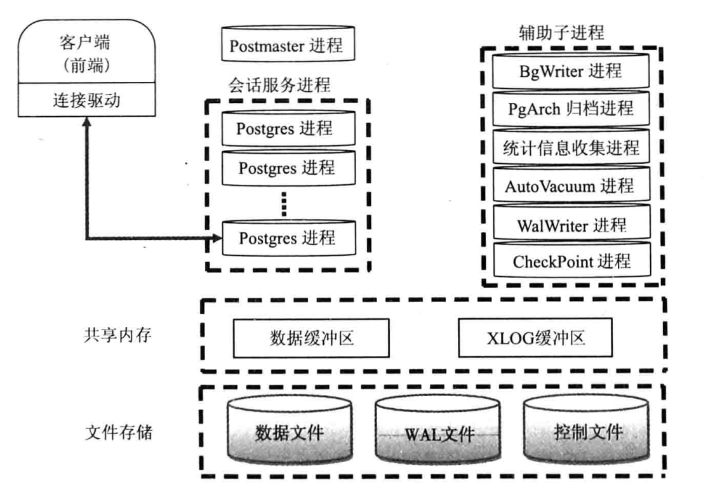
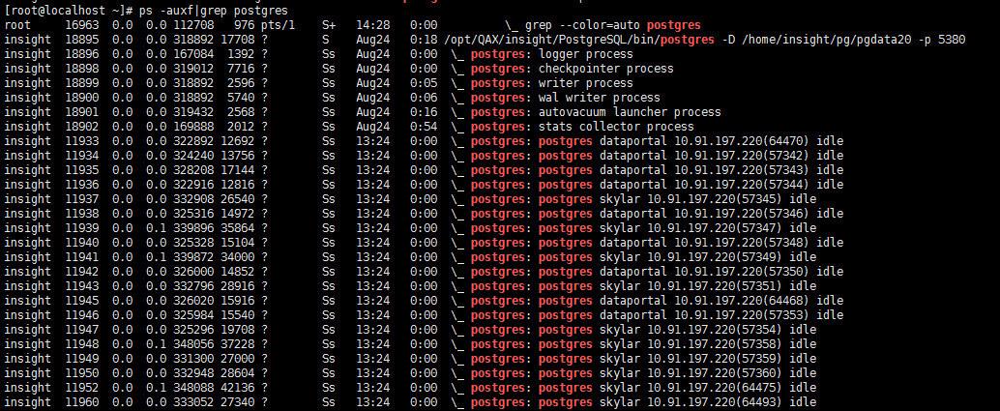
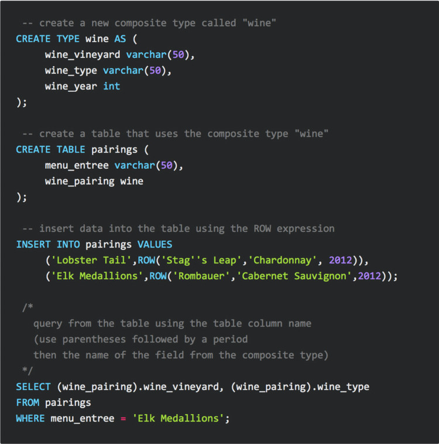
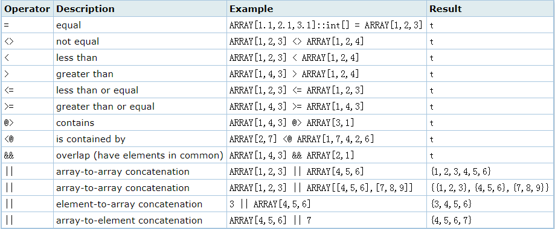
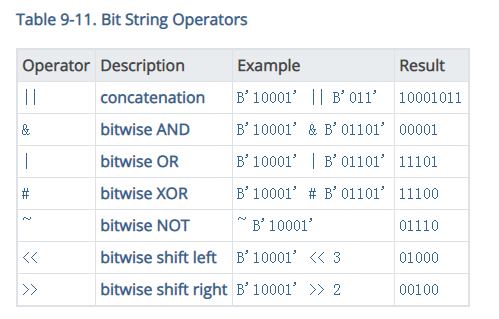
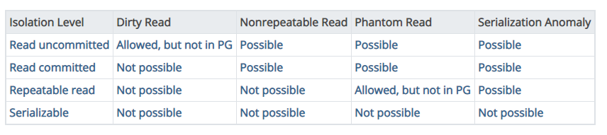
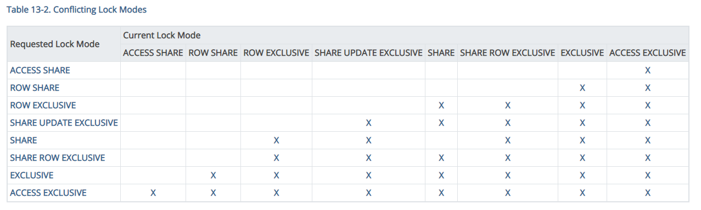
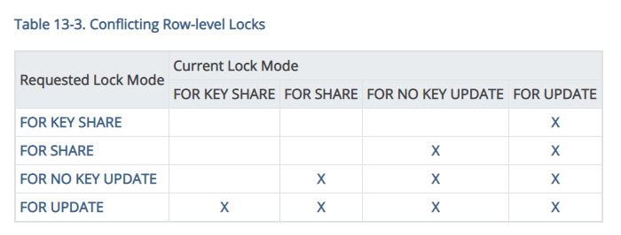

- [postgres knowledge](#postgres-knowledge)
  - [postgres 的特点](#postgres-的特点)
  - [架构](#架构)
  - [postgres 常用命令](#postgres-常用命令)
    - [命令行操作](#命令行操作)
    - [psql命令](#psql命令)
  - [postgres 数据类型](#postgres-数据类型)
    - [JSON和JSONB](#json和jsonb)
    - [复合类型](#复合类型)
    - [数组类型](#数组类型)
    - [bit类型](#bit类型)
    - [区间类型](#区间类型)
    - [文本搜索类型](#文本搜索类型)
  - [postgres 索引](#postgres-索引)
    - [Btree](#btree)
    - [Hash](#hash)
    - [GIN (Generalized Inverted Index)](#gin-generalized-inverted-index)
  - [语法](#语法)
    - [自增序列](#自增序列)
    - [grouping sets](#grouping-sets)
  - [PostgreSQL的模式、表空间、用户间的关系](#postgresql的模式表空间用户间的关系)
    - [模式](#模式)
    - [表空间](#表空间)
    - [角色和用户的关系](#角色和用户的关系)
  - [事务](#事务)
    - [事务隔离级别](#事务隔离级别)
    - [锁机制](#锁机制)
      - [表锁](#表锁)
      - [行锁](#行锁)
      - [Advisory lock 咨询锁](#advisory-lock-咨询锁)
    - [MVCC](#mvcc)
  - [pgbench](#pgbench)
  - [秒杀](#秒杀)
    - [ad lock 用于秒杀](#ad-lock-用于秒杀)
    - [skip locked](#skip-locked)
  - [分页](#分页)
  - [VACUUM](#vacuum)
  - [PostgreSQL TOAST 技术](#postgresql-toast-技术)
  - [extension](#extension)
    - [file_fdw](#file_fdw)
  - [postgres 主备配置](#postgres-主备配置)
  - [postgres docker部署](#postgres-docker部署)
  - [OLTP OLAP](#oltp-olap)
  - [系统监控](#系统监控)
  - [全文本搜索](#全文本搜索)
  - [集群](#集群)
  - [大表创建](#大表创建)
  - [使用规范](#使用规范)
  - [分表](#分表)
  - [表膨胀](#表膨胀)
    - [回收膨胀的空间](#回收膨胀的空间)
    - [避免表膨胀的方法](#避免表膨胀的方法)
  - [事务ID回卷问题](#事务id回卷问题)

# postgres knowledge
## postgres 的特点
* 开源
* 支持丰富的数据类型和自定义类型(JSON JSONB ARRAY XML)
* 提供丰富的接口，很容易扩展功能 (Extension)
* 支持使用流行的语言写自定义函数 (PL/Perl PL/Python PL/pgSQL)

[PostgreSQL优于其他开源数据库的特性：Part I](https://postgres.fun/20151209093052.html)

[PostgreSQL优于其他开源数据库的特性：Part II](https://postgres.fun/20151211151702.html)

## 架构
1.进程和内存结构图  
   




2.主进程  
postgres 常驻进程  
也称为Postmaster，是整个数据库实例的总控进程，负责启动和关闭该数据库实例。

默认监听UNIX Domain Socket和TCP/IP（Windows等一部分的平台只监听tcp/ip）的5432端口，等待来自前端的的连接处理。监听的端口号可以在PostgreSQL的设置文件postgresql.conf里面可以改。

一旦有前端连接过来，postgres会通过fork(2)生成子进程。没有Fork(2)的windows平台的话，则利用createProcess()生成新的进程。这种情形的话，和fork(2)不同的是，父进程的数据不会被继承过来，所以需要利用共享内存把父进程的数据继承过来。

postgres 子进程  
子进程根据pg_hba.conf定义的安全策略来判断是否允许进行连接，根据策略，会拒绝某些特定的IP及网络，或者也可以只允许某些特定的用户或者对某些数据库进行连接。

Postgres会接受前端过来的查询，然后对数据库进行检索，最好把结果返回，有时也会对数据库进行更新。更新的数据同时还会记录在事务日志里面（PostgreSQL称为WAL日志），这个主要是当停电的时候，服务器当机，重新启动的时候进行恢复处理的时候使用的。另外，把日志归档保存起来，可在需要进行恢复的时候使用。在PostgreSQL 9.0以后，通过把WAL日志传送其他的postgreSQL，可以实时得进行数据库复制，这就是所谓的‘数据库复制’功能。

3.Syslogger（系统日志）进程  
需要在Postgres.conf中logging_collection设置为on，此时主进程才会启动Syslogger辅助进程。

4.BgWriter(后台)进程  
把共享内存中的脏页写到磁盘上的进程。主要是为了提高插入、更新和删除数据的性能。

5.WalWrite（预写式日志）进程  
WAL：Write Ahead Log（预写式日志）  
在修改数据之前把修改操作记录到磁盘中，以便后面更新实时数据时就不需要数据持久化到文件中。

6.PgArch（归档）进程  
WAL日志会被循环使用，PgArch在归档前会把WAL日志备份出来。通过PITY（Point in Time Recovery）技术，可以对数据库进行一次全量备份后，该技术将备份时间点之后的WAL日志通过归档进行备份，使用数据库的全量备份再加上后面产生的WAL日志，即可把数据库向前推到全量备份后的任意一个时间点。

7.AutoVacuum（自动清理）进程  
在PostgreSQL数据库中，对表进行DELETE操作后，旧的数据并不会立即被删除，并且，在更新数据时，也并不会在旧的数据上做更新，而是新生成一行数据。旧的数据只是被标识为删除状态，只有在没有并发的其他事务读到这些就数据时，它们才会被清楚。这个清除工作就有AutoVacuum进程完成。

8.PgStat（统计数据收集）进程  
做数据的统计收集工作。主要用于查询优化时的代价估算，包括一个表和索引进行了多少次的插入、更新、删除操作，磁盘块读写的次数、行的读次数。pg_statistic中存储了PgStat收集的各类信息。

9.共享内存  
PostgreSQL启动后，会生成一块共享内存，用于做数据块的缓冲区，以便提高读写性能。WAL日志缓冲区和Clog缓冲区也存在共享内存中，除此之外还有全局信息比如进程、锁、全局统计等信息也保存在共享内存中。

使用"mmap()"方式的共享内存，使用此内存的好处是不在需要配置"System V"共享内存的参数"kernel.shmmax"和"kernel.shmall”，就能使用较大的共享内存。

10.本地内存  
非全局存储的数据都存在本地内存中，主要包括：

* 临时缓冲区：用于访问临时表的缓冲区

* work_mem: 内部排序操作和Hash表在使用临时操作文件之前使用的存储缓冲区。

* manintance_work_mem: 在维护操作比如：VACUUM、CREATE INDEX、ALTER TABLE ADD FOREIGN Key等中使用的内存缓冲区。


## postgres 常用命令
### 命令行操作
初始化数据库，可以指定默认的超级管理员名字，不指定时会使用当前的操作系统用户名 
```
initdb -D /opt/pgdata -U postgres 
```


### psql命令
执行psql命令连接数据库进入psql命令行，psql的命令都以 \ 开头

psql -l 可以查看有哪些数据库
```
postgres@9b3f17cb2d8c:~$ psql -l
                                   List of databases
   Name    |  Owner   | Encoding |  Collate   |   Ctype    |     Access privileges     
-----------+----------+----------+------------+------------+---------------------------
 postgres  | postgres | UTF8     | en_US.utf8 | en_US.utf8 | postgres=CTc/postgres    +
           |          |          |            |            | oc_18800200553=c/postgres
 template0 | postgres | UTF8     | en_US.utf8 | en_US.utf8 | =c/postgres              +
           |          |          |            |            | postgres=CTc/postgres
 template1 | postgres | UTF8     | en_US.utf8 | en_US.utf8 | =c/postgres              +
           |          |          |            |            | postgres=CTc/postgres
(3 rows)

```

```
postgres=# \l
                                   List of databases
   Name    |  Owner   | Encoding |  Collate   |   Ctype    |     Access privileges     
-----------+----------+----------+------------+------------+---------------------------
 postgres  | postgres | UTF8     | en_US.utf8 | en_US.utf8 | postgres=CTc/postgres    +
           |          |          |            |            | oc_18800200553=c/postgres
 template0 | postgres | UTF8     | en_US.utf8 | en_US.utf8 | =c/postgres              +
           |          |          |            |            | postgres=CTc/postgres
 template1 | postgres | UTF8     | en_US.utf8 | en_US.utf8 | =c/postgres              +
           |          |          |            |            | postgres=CTc/postgres
(3 rows)

```

切换到另一个数据库
```
postgres=# \c skylar
You are now connected to database "skylar" as user "insight".
```

显示当前数据库所有表
```
postgres=# \d
                             List of relations
 Schema |                 Name                 |   Type   |     Owner      
--------+--------------------------------------+----------+----------------
 public | oc_accounts                          | table    | oc_18800200553
 public | oc_activity                          | table    | oc_18800200553
 public | oc_activity_activity_id_seq          | sequence | oc_18800200553
 public | oc_activity_mq                       | table    | oc_18800200553
 public | oc_activity_mq_mail_id_seq           | sequence | oc_18800200553
 public | oc_addressbookchanges                | table    | oc_18800200553
 public | oc_addressbookchanges_id_seq         | sequence | oc_18800200553
 public | oc_addressbooks                      | table    | oc_18800200553
 public | oc_addressbooks_id_seq               | sequence | oc_18800200553
 public | oc_appconfig                         | table    | oc_18800200553
 public | oc_authtoken                         | table    | oc_18800200553
......
```

显示指定表的结构定义
```
postgres=# \d oc_accounts
                       Table "public.oc_accounts"
 Column |         Type          |               Modifiers                
--------+-----------------------+----------------------------------------
 uid    | character varying(64) | not null default ''::character varying
 data   | text                  | not null default ''::text
Indexes:
    "oc_accounts_pkey" PRIMARY KEY, btree (uid)

```

显示索引信息
```
postgres=# \d oc_accounts_pkey
       Index "public.oc_accounts_pkey"
 Column |         Type          | Definition 
--------+-----------------------+------------
 uid    | character varying(64) | uid
primary key, btree, for table "public.oc_accounts"

```

每列数据单行展示
```
postgres=# \x
Expanded display is on.
postgres=# select * from oc_activity;
-[ RECORD 1 ]-+------------------------------------------------------------------------------------------------------------------------------------------------
activity_id   | 1
timestamp     | 1597145540
priority      | 30
type          | file_created
user          | 18800200553
affecteduser  | 18800200553
app           | files
subject       | created_self
subjectparams | [{"6":"\/Documents"}]
message       | 
messageparams | []
file          | /Documents
link          | http://119.45.227.222:8000/index.php/apps/files/?dir=/
object_type   | files
object_id     | 6
-[ RECORD 2 ]-+------------------------------------------------------------------------------------------------------------------------------------------------
activity_id   | 2
timestamp     | 1597145540
priority      | 30
type          | file_created
user          | 18800200553
affecteduser  | 18800200553
app           | files
subject       | created_self
subjectparams | [{"7":"\/Documents\/Welcome to Nextcloud Hub.docx"}]
message       | 
messageparams | []
file          | /Documents/Welcome to Nextcloud Hub.docx
link          | http://119.45.227.222:8000/index.php/apps/files/?dir=/Documents
object_type   | files
object_id     | 7
```

## postgres 数据类型
### JSON和JSONB
PostgreSQL支持丰富的NOSQL特性。
PostgreSQL支持两种JSON数据类型：json和jsonb，两种类型在使用上几乎完全相同，两者主要区别为以下：json存储格式为文本而jsonb存储格式为二进制 ，由于存储格式的不同使得两种json数据类型的处理效率不一样，json类型以文本存储并且存储的内容和输入数据一样，当检索json数据时必须重新解析，而jsonb以二进制形式存储已解析好的数据，当检索jsonb数据时不需要重新解析，因此json写入比jsonb快，但检索比jsonb慢。

操作符 #> 返回 json 数据字段指定的元素   
```
postgres=# select '{"a":[1,2,3],"b":[4,5,6]}'::json#>'{b,1}';
 ?column? 
----------
 5
(1 row)

```

通过 jsonb || jsonb (concatenate / overwrite) 操作符可以覆盖元素值
```
postgres=# select '{"name":"francs","age":"31"}'::jsonb || '{"age":"32"}'::jsonb; 
            ?column?             
---------------------------------
 {"age": "32", "name": "francs"}
(1 row)
```

通过操作符删除元素
```
postgres=# SELECT '{"name": "James", "email": "james@localhost"}'::jsonb - 'email';
     ?column?      
-------------------
 {"name": "James"}
(1 row)
```
### 复合类型


### 数组类型
```
postgres=# create table test_array(id serial primary key, phone int8[]);  
CREATE TABLE
postgres=# \d test_array
                          Table "public.test_array"
 Column |   Type   |                        Modifiers                        
--------+----------+---------------------------------------------------------
 id     | integer  | not null default nextval('test_array_id_seq'::regclass)
 phone  | bigint[] | 
Indexes:
    "test_array_pkey" PRIMARY KEY, btree (id)

postgres=# insert into test_array(phone) values ('{1,2}');
INSERT 0 1
postgres=# insert into test_array(phone) values (array[3,4,5]); 
INSERT 0 1
postgres=# select * From test_array; 
 id |  phone  
----+---------
  1 | {1,2}
  2 | {3,4,5}
(2 rows)

postgres=#  select phone[1],phone[2] from test_array where id=1;  
 phone | phone 
-------+-------
     1 |     2
(1 row)
```
数组操作符  



### bit类型
一串 1 和 0 的字符串，用于存储和直观化位掩码，占用空间少
bit(n)  bit varying(n)
```
postgres=# CREATE TABLE test (a BIT(3), b BIT VARYING(5));
CREATE TABLE
postgres=# INSERT INTO test VALUES (B'101', B'00');
INSERT 0 1
postgres=# INSERT INTO test VALUES (B'10', B'101');
ERROR:  bit string length 2 does not match type bit(3)
postgres=# INSERT INTO test VALUES (B'10'::bit(3), B'101');
INSERT 0 1
postgres=# SELECT * FROM test;
  a  |  b  
-----+-----
 101 | 00
 100 | 101
(2 rows)
```
bit类型操作



### 区间类型

### 文本搜索类型
tsvector 
tsquery

## postgres 索引
postgres支持的索引包括：btree, hash, gin, gist, sp-gist, brin, bloom(扩展接口), rum(扩展接口)

支持基于表达式建立索引

```
SELECT * FROM test1 WHERE lower(col1) = 'value';
CREATE INDEX test1_lower_col1_idx ON test1 (lower(col1));
```

支持部分索引

```
select * from tbl where id=1 and col=?; -- 其中id=1为固定的条件  
create index idx on tbl (col) where id=1;  
```

普通索引下，where 子句中使用!=或<>操作符，pg会放弃使用索引，这时最有效的方法是使用部分索引

```
create index idx1 on tbl (id) where cond1 <> xx;
```


正常情况下Postgresql建立普通btree索引时会阻塞DML(insert,update,delete)操作，直到索引完成，期间读操作不受阻塞。Postgresql提供了在线创建索引的功能concurrently，使用方法
```
create index concurrently index_name on tablename();
```

使用concurrently的代价  
不使用这个参数建索引时DB只扫描一次表，使用这个参数时，会引发DB扫两次表，同时等待所有潜在会读到该索引的事务结束，系统的CPU和IO，内存等会受影响。


### Btree
CREATE INDEX命令默认创建 B-tree 索引。

主键和唯一键会自动创建Btree索引，无需另外单独再为主键和唯一键创建索引。
Btree索引适合处理能够按顺序存储的数据的
```
=,<,>,<=,>=
```
以及等效这些操作符的其他操作,如
```
BETWEEN，IN以及IS NULL和以字符串开头的模糊查询
```

Btree索引要想起作用,where条件必须包含第一个索引列。最左匹配原则

内部使用了B+树，压缩了B树的层级，能够有效节省数据库的IO查找操作

### Hash
pg 10前没有使用WAL记录，系统崩溃后需要重建,不建议使用

### GIN (Generalized Inverted Index)
通用倒排索引  
一般用来索引复合类型对象中的元素 

GIN的标准中定义了用于一维数组的操作符，如包含“@>”，被包含“<@”，相等“=”，重叠操作符“&&”。
```
postgres=# create table person (
postgres(#   id  int, 
postgres(#   name varchar(20),
postgres(#   phone varchar(32)[]
postgres(# );
CREATE TABLE
postgres=# create index idx_phone on person using gin(phone);
CREATE INDEX
postgres=# insert into person values(1,'April','{"0000000","1234567"}');
INSERT 0 1
postgres=# insert into person values(2,'Harris','{"1111111","7654321"}');
INSERT 0 1


查询号码'1111111'属于谁
postgres=# select * from person where phone @> array['1111111'::varchar(32)];
 id |  name  |       phone       
----+--------+-------------------
  2 | Harris | {1111111,7654321}
(1 row)
```

GIN索引的插入操作与btree索引不同，对于btree索引，基表增加一行，btree索引也是增加一个索引项。而对于GIN索引基表增加一行，GIN索引可能需要增加多个索引项。所以GIN索引的插入是低效的。所以PG为了解决这个问题，实现了两种插入模式：
* 正常模式  
在该模式下，基表元组产生的新的GIN索引，会被立即插入到GIN索引

* fastupdate模式  
在该模式下，基表元组产生的新的GIN索引，会被插入到pending list中，而pending list会在一定条件下批量的插入到GIN索引中

## 语法

### 自增序列
意义：并发获取nextval时，保证唯一和递增，但可能存在漏空

如何保证分区表的主键序列全局唯一？

```
postgres=# create sequence seq_tab1 increment by 10000 start with 1;
CREATE SEQUENCE
postgres=# create sequence seq_tab2 increment by 10000 start with 2;
CREATE SEQUENCE
postgres=# create sequence seq_tab3 increment by 10000 start with 3;
CREATE SEQUENCE
postgres=# create table tab1 (id int primary key default nextval('seq_tab1') check(mod(id,10000)=1), info text);
CREATE TABLE
postgres=# create table tab2 (id int primary key default nextval('seq_tab2') check(mod(id,10000)=2), info text);
CREATE TABLE
postgres=# create table tab3 (id int primary key default nextval('seq_tab3') check(mod(id,10000)=3), info text);
CREATE TABLE
postgres=# insert into tab1 (info) select generate_series(1,10);
INSERT 0 10
postgres=# insert into tab2 (info) select generate_series(1,10);
INSERT 0 10
postgres=# insert into tab3 (info) select generate_series(1,10);
INSERT 0 10
postgres=# select * from tab1;
  id   | info 
-------+------
     1 | 1
 10001 | 2
 20001 | 3
 30001 | 4
 40001 | 5
 50001 | 6
 60001 | 7
 70001 | 8
 80001 | 9
 90001 | 10
(10 rows)

postgres=# select * from tab2;
  id   | info 
-------+------
     2 | 1
 10002 | 2
 20002 | 3
 30002 | 4
 40002 | 5
 50002 | 6
 60002 | 7
 70002 | 8
 80002 | 9
 90002 | 10
(10 rows)

postgres=# select * from tab3;
  id   | info 
-------+------
     3 | 1
 10003 | 2
 20003 | 3
 30003 | 4
 40003 | 5
 50003 | 6
 60003 | 7
 70003 | 8
 80003 | 9
 90003 | 10
(10 rows)
```

### grouping sets
分组函数，每个分组集合单独进行聚合计算,用于业务有多个维度的分析需求
```
postgres=# select * from t;
 id |   name   | class | score 
----+----------+-------+-------
  1 | math     |     1 |    90
  2 | math     |     2 |    80
  3 | math     |     1 |    70
  4 | chinese  |     2 |    60
  5 | chinese  |     1 |    50
  6 | chinese  |     2 |    60
  7 | physical |     1 |    70
  8 | physical |     2 |    80
  9 | physical |     1 |    90
(9 rows)

postgres=# select name,class,sum(score)
postgres-# from t
postgres-# group by name,class
postgres-# order by name,class;
   name   | class | sum 
----------+-------+-----
 chinese  |     1 |  50
 chinese  |     2 | 120
 math     |     1 | 160
 math     |     2 |  80
 physical |     1 | 160
 physical |     2 |  80
(6 rows)

postgres=# select name,class,sum(score)
from t
group by grouping sets((name),(class)
,()) order by name,class;
   name   | class | sum 
----------+-------+-----
 chinese  |       | 170
 math     |       | 240
 physical |       | 240
          |     1 | 370
          |     2 | 280
          |       | 650
(6 rows)
```
* rollup((a),(b),(c))等价于grouping sets((a,b,c),(a,b),(a),()) 
```
postgres=# select name,class,sum(score)
from t
group by rollup((name),(class)
) order by name,class;
   name   | class | sum 
----------+-------+-----
 chinese  |     1 |  50
 chinese  |     2 | 120
 chinese  |       | 170
 math     |     1 | 160
 math     |     2 |  80
 math     |       | 240
 physical |     1 | 160
 physical |     2 |  80
 physical |       | 240
          |       | 650
(10 rows)
```
* cube((a),(b),(c))等价于grouping sets((a,b,c),(a,b),(a,c),(a),(b,c),(b),(c),()) 
```
postgres=# select name,class,sum(score)
from t
group by cube((name),(class)
) order by name,class;
   name   | class | sum 
----------+-------+-----
 chinese  |     1 |  50
 chinese  |     2 | 120
 chinese  |       | 170
 math     |     1 | 160
 math     |     2 |  80
 math     |       | 240
 physical |     1 | 160
 physical |     2 |  80
 physical |       | 240
          |     1 | 370
          |     2 | 280
          |       | 650
(12 rows)
```

## PostgreSQL的模式、表空间、用户间的关系
### 模式
PostgreSQL 模式（SCHEMA）可以看着是一个表的集合。

一个模式可以包含视图、索引、据类型、函数和操作符等。

相同的对象名称可以被用于不同的模式中而不会出现冲突，例如 schema1 和 myschema 都可以包含名为 mytable 的表。

使用模式的优势：

* 允许多个用户使用一个数据库并且不会互相干扰。

* 将数据库对象组织成逻辑组以便更容易管理。

* 第三方应用的对象可以放在独立的模式中，这样它们就不会与其他对象的名称发生冲突。

通常情况下，创建和访问表时，如果不知道模式，默认是访问 public 模式。

可以针对模式进行权限控制。

### 表空间
表空间是实际的数据存储的地方。一个数据库schema可能存在于多个表空间，相似地，一个表空间也可以为多个schema服务。一个表空间可以让多个数据库使用，而一个数据库也可以使用多个表空间。

通过使用表空间，管理员可以控制磁盘的布局。表空间的最常用的作用是优化性能，例如，一个最常用的索引可以建立在非常快的硬盘上，而不太常用的表可以建立在便宜的硬盘上，比如用来存储用于进行归档文件的表。

postgres 自带了两个表空间，pg_default， pg_global

表空间pg_default是用来存储系统目录对象、用户表、用户表index、和临时表、临时表index、内部临时表的默认空间。对应存储目录$PADATA/base/

表空间pg_global用来存放系统字典表；对应存储目录$PADATA/global/

```
postgres=# CREATE TABLESPACE tsp OWNER postgres LOCATION '/var/lib/postgresql/tsp';
CREATE TABLESPACE
postgres=# CREATE DATABASE dbtsp OWNER postgres TEMPLATE template1 TABLESPACE tsp;
CREATE DATABASE
postgres=# \l
                                   List of databases
   Name    |  Owner   | Encoding |  Collate   |   Ctype    |     Access privileges     
-----------+----------+----------+------------+------------+---------------------------
 dbtsp     | postgres | UTF8     | en_US.utf8 | en_US.utf8 | 
 postgres  | postgres | UTF8     | en_US.utf8 | en_US.utf8 | postgres=CTc/postgres    +
           |          |          |            |            | oc_18800200553=c/postgres
 template0 | postgres | UTF8     | en_US.utf8 | en_US.utf8 | =c/postgres              +
           |          |          |            |            | postgres=CTc/postgres
 template1 | postgres | UTF8     | en_US.utf8 | en_US.utf8 | =c/postgres              +
           |          |          |            |            | postgres=CTc/postgres
(4 rows)

postgres=# \db
               List of tablespaces
    Name    |  Owner   |        Location         
------------+----------+-------------------------
 pg_default | postgres | 
 pg_global  | postgres | 
 tsp        | postgres | /var/lib/postgresql/tsp
(3 rows)
```

### 角色和用户的关系
CREATE USER除了默认具有LOGIN权限之外，其他与CREATE ROLE是完全相同的
```
postgres=# CREATE ROLE custom PASSWORD 'custom';
CREATE ROLE
postgres=# CREATE USER guest PASSWORD 'guest';
CREATE ROLE
postgres=# \du
                                      List of roles
   Role name    |                         Attributes                         | Member of 
----------------+------------------------------------------------------------+-----------
 custom         | Cannot login                                               | {}
 guest          |                                                            | {}
 oc_18800200553 | Create DB                                                  | {}
 postgres       | Superuser, Create role, Create DB, Replication, Bypass RLS | {}
 replica        | Replication                                                | {}

```

## 事务
Postgres数据库与其他数据库最大的区别是，DDL能放入事务中，删表，TRUNCATE，创建函数，索引，都可以放在事务里原子生效，或者回滚。

因为有这个功能，所以非常适合把PostgreSQL作为Sharding的分布式数据系统的底层数据库。比如，在Sharding中，常常需要在多个结点中建相同的表，这时可以考虑把建表语句放在同一个事务中，这样就可以在各个节点上先启动一个事务，然后执行建表语句。如果某个节点执行失败，也可以把前面已执行建表成功的操作回滚掉，这样就不会出现部分节点建表成功，部分节点失败的情况。

一个事务里通过RENAME，完成两张表的王车易位
```
BEGIN;
-- You probably want to make sure that no one else is
-- INSERT / UPDATE / DELETE'ing from the original table, otherwise
-- those changes may be lost during this switchover process. One way
-- to do that would be via:
-- LOCK TABLE "table" IN SHARE ROW EXCLUSIVE mode;
CREATE TABLE "table_new" (LIKE "table");
INSERT INTO "table_new" ...;

-- The ALTER TABLE ... RENAME TO command takes an Access Exclusive lock on "table",
-- but these final few statements should be fast.
ALTER TABLE "table" RENAME TO "table_old";
ALTER TABLE "table_new" RENAME TO "table";
DROP TABLE "table_old";

COMMIT;
```

### 事务隔离级别
数据库的隔离级别有四种
* 读未提交（READ UNCOMMITTED）
* 读已提交（READ COMMITTED）
* 重复读（REPEATABLE READ）
* 串行化（SERIALIZABLE）

对于并发事务，我们不希望发生的行为如下：

* 脏读：一个事务读取了另一个未提交的事务写入的数据。
* 不可重复读：一个事务重新读取前面读取过的数据时，发现该数据已改变。
* 幻读：一个事务开始后，需要根据数据库中现有的数据做一些更新，于是重新执行一个查询，返回符合查询条件的行，这时发现这些行因为其它最近提交的事务而发生了改变，导致现有事务如果再进行下去可能发发生逻辑上的错误。
* 序列化异常：成功提交一组事务的结果与按照各种可能顺序运行这些事务的结果不一致。
  


在PostgreSQL中，可以请求四种标准事务隔离级别中的任意一种，但是内部只实现了三种不同的隔离级别，即 PostgreSQL 的读未提交模式的行为和读已提交相同

[Are postgresql transaction levels repeatable read and serializable the same?]([images/pg_isolation.jpg](https://stackoverflow.com/questions/30668991/are-postgresql-transaction-levels-repeatable-read-and-serializable-the-same))

[PostgreSQL 9.6.19 Documentation: Transaction Isolation](https://www.postgresql.org/docs/9.6/transaction-iso.html)

PostgreSQL 数据库的默认事务隔离级别是 Read committed 
```
postgres=# show default_transaction_isolation; 
 default_transaction_isolation 
-------------------------------
 read committed
(1 row)
```

### 锁机制
#### 表锁
```
LOCK [ TABLE ] [ ONLY ] name [ * ] [, ...] [ IN lockmode MODE ] [ NOWAIT ]
```
lockmode包括以下几种：

ACCESS SHARE | ROW SHARE | ROW EXCLUSIVE | SHARE UPDATE EXCLUSIVE| SHARE | SHARE ROW EXCLUSIVE | EXCLUSIVE | ACCESS EXCLUSIVE

LOCK TABLE命令用于获取一个表锁，获取过程将阻塞一直到等待的锁被其他事务释放。如果使用NOWAIT关键字则如果获取不到锁，将不会等待而是直接返回，放弃执行当前指令并抛出一个错误(error)。一旦获取到锁，将一直持有锁直到事务结束。(没有主动释放锁的命令，锁总是会在事务结束的时候被释放)。

当使用自动获取锁的模式的时候，PostgreSQL总是尽可能地使用限制最小的模式。LOCK TABLE命令使我们可以自己定义锁的限制大小。比如一个应用程序使用事务在读提交(Read Committed isolation level)模式下需要保证数据库的数据在事务期间保持稳定，于是可以使用SHARE锁模式在读取前对表进行加锁。这可以防止并发的数据改变并且可以保证后续的事务对这个表的读取不会读到没有提交的数据，因为SHARE锁和由写入事务持有的ROW EXCLUSIVE锁是冲突的，所以对于想要使用SHARE锁对表进行加锁的事务，将会等到它之前所有持有该表的ROW EXCLUSIVE锁的事务commit或者是roll back。因此，一旦获取了表的SHARE锁，将不会有没有提交的数据，同样也不会有其他事务能够对表数据进行改变，直到当前事务释放SHARE锁。



#### 行锁
一个事务的多个子事务可以在同一行上获取冲突的行锁，但不同的事务不能在同一行上获取冲突的行锁。  
行锁不影响数据query，只阻塞在同一行上的写操作和加锁操作

主动加锁
```
select * from db_user where name='lisi' for update;
```
默认加锁
```
UPDATE accounts SET balance = balance + 100.00 WHERE acctnum = 11111;
```

#### Advisory lock 咨询锁
postgres提供给应用层使用的锁，数据库本身不会主动使用 
库级别的锁，分为会话锁和事务锁，比表锁、行锁轻量 
pg_try_advisory_lock(id)  获取则占住，没有获取成功则返回失败
用于高并发更新同一行数据的场景，见[秒杀](##秒杀)




### MVCC
PostgreSQL利用多版本并发控制(MVCC)来维护数据的一致性。每个事务看到的都只是一小段时间之前的数据快照(一个数据库版本)，而不是数据的当前状态。


MVCC的实现方法有两种：

1.写新数据时，把旧数据移到一个单独的地方，如回滚段中，其他人读数据时，从回滚段中把旧的数据读出来；

2.写数据时，旧数据不删除，而是把新数据插入。

PostgreSQL数据库使用第二种方法，而Oracle数据库和MySQL中的innodb引擎使用的是第一种方法。

与oracle数据库和MySQL中的innodb引擎相比较，PostgreSQL的MVCC实现方式的优缺点如下。

优点：

1.事务回滚可以立即完成，无论事务进行了多少操作；

2.数据可以进行很多更新，不必像Oracle和MySQL的Innodb引擎那样需要经常保证回滚段不会被用完，也不会像oracle数据库那样经常遇到“ORA-1555”错误的困扰；

缺点：

1.旧版本数据需要清理。PostgreSQL清理旧版本的命令成为Vacuum；

2.旧版本的数据会导致查询更慢一些，因为旧版本的数据存在于数据文件中，查询时需要扫描更多的数据块

## pgbench

pgbench是一个用于在PostgreSQL数据库中运行基准测试的简单程序。pgbench在多个并发的数据库会话中反复运行一系列相同的SQL命令，并计算事务执行的平均速率（每秒执行的事务个数）。允许基于开发者自己书写的事务脚本文件进行测试。

命令行格式
```
pgbench [OPTION]... [DBNAME]
```

2job 4client跑30秒
```
postgres@4fb940274ff7:~$ pgbench -T 30 -j 2 -S -c 4 postgres
starting vacuum...end.
transaction type: <builtin: select only>
scaling factor: 1
query mode: simple
number of clients: 4
number of threads: 2
duration: 30 s
number of transactions actually processed: 1248959
latency average = 0.096 ms
tps = 41631.679408 (including connections establishing)
tps = 41633.797860 (excluding connections establishing)

```
使用prepared statement方式，不执行VACUUM，报告平均延迟时间，每1秒钟报告线程进度，执行test1.sql里的sql，模拟20个client，启用20个线程，持续执行60秒
```
pgbench -M prepared -n -r -P 1 -f ./test1.sql -c 20 -j 20 -T 60 
```

## 秒杀
[PostgreSQL 秒杀场景优化](https://github.com/digoal/blog/blob/master/201509/20150914_01.md)  
[PostgreSQL 秒杀4种方法 - 增加 批量流式加减库存 方法](https://github.com/digoal/blog/blob/master/201801/20180105_03.md)

### ad lock 用于秒杀
秒杀场景的典型瓶颈在于对同一条记录的多次更新请求，然后只有一个或者少量请求是成功的，其他请求是以失败或更新不到告终。  
使用一个标记位来表示这条记录是否已经被更新，或者记录更新的次数
```
update tbl set xxx=xxx,upd_cnt=upd_cnt+1 where id=pk and upd_cnt+1<=5;   -- 假设可以秒杀5台
```
这种方法的弊端：

获得锁的用户在处理这条记录时，可能成功，也可能失败，或者可能需要很长时间，（例如数据库响应慢）在它结束事务前，其他会话只能等着。

使用for update nowait的方式
```
begin;  
select 1 from tbl where id=pk for update nowait;  --  如果用户无法即刻获得锁，则返回错误。从而这个事务回滚。  
update tbl set xxx=xxx,upd_cnt=upd_cnt+1 where id=pk and upd_cnt+1<=5;  
end;  
```
这种方法可以减少用户的等待时间，因为无法即刻获得锁后就直接返回了。

但是这种方法也存在一定的弊端，对于一个商品，如果可以秒杀多台的话，使用1条记录来存储多台，降低了秒杀的并发性。

因为这里使用的是行锁。

postgreSQL提供了一个锁类型，advisory锁，这种锁比行锁更加轻量，支持会话级别和事务级别。（但是需要注意ID是全局的，否则会相互干扰，也就是说，所有参与秒杀或者需要用到advisory lock的ID需要在单个库内保持全局唯一）
```
update tbl set xxx=xxx,upd_cnt=upd_cnt+1 where id=pk and upd_cnt+1<=5 and pg_try_advisory_xact_lock(:id);  
```

```
pg_try_advisory_xact_lock() 
  Obtain exclusive transaction level advisory lock if available
```

### skip locked

```postgres=# CREATE TABLE tb1(id int,v int);
CREATE TABLE
postgres=# insert into tb1 values (1,100);
INSERT 0 1
postgres=# insert into tb1 values (2,101);
INSERT 0 1
postgres=# select * from tb1;
 id |  v  
----+-----
  1 | 100
  2 | 101
(2 rows)

postgres=# begin;
BEGIN
postgres=# select * from tb1 order by 1 limit 1 for update skip locked;
 id |  v  
----+-----
  1 | 100
(1 row)

```
另开一个session,下面可见取到的是a为2的记录，跳过了a=1的记录，而且不需要等待
```
postgres=# select * from tb1;
 id |  v  
----+-----
  1 | 100
  2 | 101
(2 rows)

postgres=# begin;
BEGIN
postgres=# select * from tb1 order by 1 limit 1 for update skip locked;
 id |  v  
----+-----
  2 | 101
(1 row)
```


## 分页
获取总条数使用count(*)会很慢，若允许使用评估行数，可以创建一个函数，从explain中抽取返回的记录数

```
CREATE OR REPLACE FUNCTION countit(text)                    
RETURNS float4           
LANGUAGE plpgsql AS          
$DECLARE               
    v_plan json;                
BEGIN                      
    EXECUTE 'EXPLAIN (FORMAT JSON) '||$1                                
        INTO v_plan;                                                                       
    RETURN v_plan #>> '{0,Plan,"Plan Rows"}';  
END;  
$;  
```

```
postgres=#  create table t1234(id int, info text);  
CREATE TABLE
postgres=# insert into t1234 select generate_series(1,1000000),'test';  
INSERT 0 1000000
postgres=# analyze t1234; 
ANALYZE
postgres=#  select countit('select * from t1234 where id<1000');  
 countit 
---------
     970
(1 row)

postgres=# explain select * from t1234 where id<1000;  
                        QUERY PLAN                         
-----------------------------------------------------------
 Seq Scan on t1234  (cost=0.00..17906.00 rows=970 width=9)
   Filter: (id < 1000)
(2 rows)

postgres=# select countit('select * from t1234 where id between 1 and 1000 or (id between 100000 and 101000)');
 countit 
---------
    1907
(1 row)

postgres=# explain select * from t1234 where id between 1 and 1000 or (id between 100000 and 101000);
                                   QUERY PLAN                                    
---------------------------------------------------------------------------------
 Seq Scan on t1234  (cost=0.00..25406.00 rows=1907 width=9)
   Filter: (((id >= 1) AND (id <= 1000)) OR ((id >= 100000) AND (id <= 101000)))
(2 rows)

```

## VACUUM
[PostgreSQL 9.6.19 Documentation: Routine Vacuuming](https://www.postgresql.org/docs/9.6/routine-vacuuming.html)

PostgreSQL数据库管理工作中,定期vacuum是一个重要的工作。  
vacuum的效果：

1. 释放原先更新/删除行所占据的磁盘空间。
2. 更新POSTGRESQL查询计划中使用的统计数据。
3. 更新visibility map，加速 index-only scans。
4. 防止因事务ID的重置而丢失非常老的数据。

第一点的原因是PostgreSQL数据的插入,更新,删除操作并不是真正放到数据库空间.如果不定期释放空间的话,由于数据太多,查询速度会巨降.  

第二点的原因是PostgreSQL在做查询处理的时候,为了是查询速度提高,会根据统计数据来确定执行计划.如果不及时更新的话,查询的效果可能不如预期.  

第四点的原因是PostgreSQL中每一个事务都会产生一个事务ID,但这个数字是有上限的. 当事务ID达到最大值后,会重新从最小值开始循环.这样如果不及时把以前的数据释放掉的话,原来的老数据会因为事务ID的丢失而丢失掉.

虽然Postgresql中有自动的vacuum (AUTOVACUUM实例)，但是如果是大批量的数据IO可能会导致自动执行很慢，需要配合手动执行以及自己的脚本来清理数据库。

PostgreSQL数据库的statstic模块有一些计数器，用于统计每个表被插入、更新、删除的记录数。
通过这些视图，可以查看计数器统计到的一些计数：
```
postgres=# \dv pg_stat*
                     List of relations
   Schema   |            Name             | Type |  Owner   
------------+-----------------------------+------+----------
 pg_catalog | pg_stat_activity            | view | postgres
 pg_catalog | pg_stat_all_indexes         | view | postgres
 pg_catalog | pg_stat_all_tables          | view | postgres
 pg_catalog | pg_stat_archiver            | view | postgres
 pg_catalog | pg_stat_bgwriter            | view | postgres
 pg_catalog | pg_stat_database            | view | postgres
 pg_catalog | pg_stat_database_conflicts  | view | postgres
 pg_catalog | pg_stat_progress_vacuum     | view | postgres
 pg_catalog | pg_stat_replication         | view | postgres
 pg_catalog | pg_stat_ssl                 | view | postgres
 pg_catalog | pg_stat_sys_indexes         | view | postgres
 pg_catalog | pg_stat_sys_tables          | view | postgres
 pg_catalog | pg_stat_user_functions      | view | postgres
 pg_catalog | pg_stat_user_indexes        | view | postgres
 pg_catalog | pg_stat_user_tables         | view | postgres
 pg_catalog | pg_stat_wal_receiver        | view | postgres
 pg_catalog | pg_stat_xact_all_tables     | view | postgres
 pg_catalog | pg_stat_xact_sys_tables     | view | postgres
 pg_catalog | pg_stat_xact_user_functions | view | postgres
 pg_catalog | pg_stat_xact_user_tables    | view | postgres
 pg_catalog | pg_statio_all_indexes       | view | postgres
 pg_catalog | pg_statio_all_sequences     | view | postgres
 pg_catalog | pg_statio_all_tables        | view | postgres
 pg_catalog | pg_statio_sys_indexes       | view | postgres
 pg_catalog | pg_statio_sys_sequences     | view | postgres
 pg_catalog | pg_statio_sys_tables        | view | postgres
 pg_catalog | pg_statio_user_indexes      | view | postgres
 pg_catalog | pg_statio_user_sequences    | view | postgres
 pg_catalog | pg_statio_user_tables       | view | postgres
 pg_catalog | pg_stats                    | view | postgres
(30 rows)

```
例如表相关的计数：
```
postgres=# \d pg_stat_all_tables
            View "pg_catalog.pg_stat_all_tables"
       Column        |           Type           | Modifiers 
---------------------+--------------------------+-----------
 relid               | oid                      | 
 schemaname          | name                     | 
 relname             | name                     | 
 seq_scan            | bigint                   | 
 seq_tup_read        | bigint                   | 
 idx_scan            | bigint                   | 
 idx_tup_fetch       | bigint                   | 
 n_tup_ins           | bigint                   | 
 n_tup_upd           | bigint                   | 
 n_tup_del           | bigint                   | 
 n_tup_hot_upd       | bigint                   | 
 n_live_tup          | bigint                   | 
 n_dead_tup          | bigint                   | 
 n_mod_since_analyze | bigint                   | 
 last_vacuum         | timestamp with time zone | 
 last_autovacuum     | timestamp with time zone | 
 last_analyze        | timestamp with time zone | 
 last_autoanalyze    | timestamp with time zone | 
 vacuum_count        | bigint                   | 
 autovacuum_count    | bigint                   | 
 analyze_count       | bigint                   | 
 autoanalyze_count   | bigint                   | 

```

查看某张表的计数，例如
```
postgres=# select * from pg_stat_all_tables where relname='oc_accounts';  
-[ RECORD 1 ]-------+------------
relid               | 16766
schemaname          | public
relname             | oc_accounts
seq_scan            | 0
seq_tup_read        | 0
idx_scan            | 0
idx_tup_fetch       | 0
n_tup_ins           | 0
n_tup_upd           | 0
n_tup_del           | 0
n_tup_hot_upd       | 0
n_live_tup          | 0
n_dead_tup          | 0
n_mod_since_analyze | 0
last_vacuum         | 
last_autovacuum     | 
last_analyze        | 
last_autoanalyze    | 
vacuum_count        | 0
autovacuum_count    | 0
analyze_count       | 0
autoanalyze_count   | 0

```

autovacuum launcher进程，在一个autovacuum_naptime周期内，轮询所有的database内的计数，并根据计数以及设置的阈值（表级、或全库级阈值）判断是否需要对表实施vacuum或analyze的动作。  
触发公式为
```
vacuum threshold = vacuum base threshold + vacuum scale factor * number of tuples
analyze threshold = analyze base threshold + analyze scale factor * number of tuples
```

postgres.conf 对应参数
```
#------------------------------------------------------------------------------
# AUTOVACUUM PARAMETERS
#------------------------------------------------------------------------------

#autovacuum = on                        # Enable autovacuum subprocess?  'on'
                                        # requires track_counts to also be on.
#log_autovacuum_min_duration = -1       # -1 disables, 0 logs all actions and
                                        # their durations, > 0 logs only
                                        # actions running at least this number
                                        # of milliseconds.
#autovacuum_max_workers = 3             # max number of autovacuum subprocesses
                                        # (change requires restart)
#autovacuum_naptime = 1min              # time between autovacuum runs
#autovacuum_vacuum_threshold = 50       # min number of row updates before
                                        # vacuum
#autovacuum_analyze_threshold = 50      # min number of row updates before
                                        # analyze
#autovacuum_vacuum_scale_factor = 0.2   # fraction of table size before vacuum
#autovacuum_analyze_scale_factor = 0.1  # fraction of table size before analyze
#autovacuum_freeze_max_age = 200000000  # maximum XID age before forced vacuum
                                        # (change requires restart)
#autovacuum_multixact_freeze_max_age = 400000000        # maximum multixact age
                                        # before forced vacuum
                                        # (change requires restart)
#autovacuum_vacuum_cost_delay = 20ms    # default vacuum cost delay for
                                        # autovacuum, in milliseconds;
                                        # -1 means use vacuum_cost_delay
#autovacuum_vacuum_cost_limit = -1      # default vacuum cost limit for
                                        # autovacuum, -1 means use
                                        # vacuum_cost_limit


```


## PostgreSQL TOAST 技术
[PostgreSQL TOAST 技术理解](https://cloud.tencent.com/developer/article/1004455)

PG 不允许一行数据跨页存储，对于超长的行数据，PG 会启动 TOAST ，具体就是采用压缩和切片的方式。如果启用了切片，实际数据存储在另一张系统表的多个行中，这张表就叫 TOAST 表，这种存储方式叫行外存储。

四种 TOAST 的策略：

* PLAIN ：避免压缩和行外存储。只有那些不需要 TOAST 策略就能存放的数据类型允许选择（例如 int 类型），而对于 text 这类要求存储长度超过页大小的类型，是不允许采用此策略的
* EXTENDED ：允许压缩和行外存储。一般会先压缩，如果还是太大，就会行外存储
* EXTERNA ：允许行外存储，但不许压缩。类似字符串这种会对数据的一部分进行操作的字段，采用此策略可能获得更高的性能，因为不需要读取出整行数据再解压。
* MAIN ：允许压缩，但不许行外存储。不过实际上，为了保证过大数据的存储，行外存储在其它方式（例如压缩）都无法满足需求的情况下，作为最后手段还是会被启动。因此理解为：尽量不使用行外存储更贴切。

```
postgres=# create table blog(id int, title text, content text);
CREATE TABLE
postgres=# \d+ blog;
                          Table "public.blog"
 Column  |  Type   | Modifiers | Storage  | Stats target | Description 
---------+---------+-----------+----------+--------------+-------------
 id      | integer |           | plain    |              | 
 title   | text    |           | extended |              | 
 content | text    |           | extended |              | 

postgres=# select relname,relfilenode,reltoastrelid from pg_class where relname='blog';
 relname | relfilenode | reltoastrelid 
---------+-------------+---------------
 blog    |       24587 |         24590
(1 row)

postgres=# select chunk_id,chunk_seq,length(chunk_data) from pg_toast.pg_toast_24587;
 chunk_id | chunk_seq | length 
----------+-----------+--------
(0 rows)

postgres=# insert into blog values(1, 'title', '0123456789');
INSERT 0 1
postgres=# select * from blog;
 id | title |  content   
----+-------+------------
  1 | title | 0123456789
(1 row)

postgres=# select * from pg_toast.pg_toast_24587;
 chunk_id | chunk_seq | chunk_data 
----------+-----------+------------
(0 rows)

postgres=# update blog set content=array_to_string(ARRAY(SELECT chr((48 + round(random() * 9)) :: integer) FROM generate_series(1,10000)), '') where id=1;
UPDATE 1
postgres=# select id,title,length(content) from blog;
 id | title | length 
----+-------+--------
  1 | title |  10000
(1 row)

postgres=# select chunk_id,chunk_seq,length(chunk_data) from pg_toast.pg_toast_24587;
 chunk_id | chunk_seq | length 
----------+-----------+--------
    24598 |         0 |   1996
    24598 |         1 |   1996
    24598 |         2 |   1996
    24598 |         3 |   1996
    24598 |         4 |   1996
    24598 |         5 |     20
(6 rows)

```

## extension
PostgreSQL具有插件功能，通过不同的插件拓展，实现数据库本身不包含的功能，以满足用户的需求

FDW：外部数据包装器（Foreign Data Wrapper）。  
通过FDW，用户可以用统一的方式从Pg中访问各类外部数据源（ORACLE,SQL SERVER,MYSQL,MONDODB)。

### file_fdw
使用file_fdw插件，可以通过sql读取解析文件
```
postgres=# CREATE EXTENSION file_fdw;
CREATE EXTENSION
postgres=# CREATE SERVER fileserver FOREIGN DATA WRAPPER file_fdw;
CREATE SERVER
postgres=# CREATE FOREIGN TABLE meminfo 
postgres-# (stat text, value text) 
postgres-# SERVER fileserver 
postgres-# OPTIONS (filename '/proc/meminfo', format 'csv', delimiter ':');
CREATE FOREIGN TABLE
postgres=# SELECT * FROM meminfo;
       stat        |         value          
-------------------+------------------------
 MemTotal          |         8008704 kB
 MemFree           |           194796 kB
 MemAvailable      |     7134400 kB
 Buffers           |           260136 kB
 Cached            |           6687504 kB
 SwapCached        |             0 kB
 Active            |           4010964 kB
 Inactive          |         3212696 kB
 Active(anon)      |      362516 kB
 Inactive(anon)    |     69952 kB
 Active(file)      |     3648448 kB
 Inactive(file)    |   3142744 kB
 Unevictable       |            0 kB
 Mlocked           |                0 kB
 SwapTotal         |              0 kB
 SwapFree          |               0 kB
 Dirty             |                584 kB
 Writeback         |              0 kB
 AnonPages         |         275948 kB
 Mapped            |            292076 kB
 Shmem             |             156448 kB
 Slab              |              485612 kB
 SReclaimable      |      454304 kB
 SUnreclaim        |         31308 kB
 KernelStack       |         4496 kB
 PageTables        |         12552 kB
 NFS_Unstable      |           0 kB
 Bounce            |                 0 kB
 WritebackTmp      |           0 kB
 CommitLimit       |      4004352 kB
 Committed_AS      |     2378784 kB
 VmallocTotal      |    34359738367 kB
 VmallocUsed       |        20080 kB
 VmallocChunk      |    34359712252 kB
 HardwareCorrupted |      0 kB
 AnonHugePages     |      61440 kB
 CmaTotal          |               0 kB
 CmaFree           |                0 kB
 HugePages_Total   |        0
 HugePages_Free    |         0
 HugePages_Rsvd    |         0
 HugePages_Surp    |         0
 Hugepagesize      |        2048 kB
 DirectMap4k       |        87920 kB
 DirectMap2M       |      5154816 kB
 DirectMap1G       |      5242880 kB
(46 rows)

postgres=# SELECT * FROM meminfo WHERE stat IN ('MemTotal','MemFree');
   stat   |        value        
----------+---------------------
 MemTotal |         8008704 kB
 MemFree  |           193540 kB
(2 rows)

```

postgres10支持从命令行输出读取信息
```
CREATE FOREIGN TABLE process_status (
  username TEXT,
  pid      INTEGER,
  cpu      NUMERIC,
  mem      NUMERIC,
  vsz      BIGINT,
  rss      BIGINT,
  tty      TEXT,
  stat     TEXT,
  start    TEXT,
  time     TEXT,
  command  TEXT
) SERVER fs OPTIONS (
PROGRAM $$ps aux | awk '{print $1,$2,$3,$4,$5,$6,$7,$8,$9,$10,substr($0,index($0,$11))}' OFS='\037'$$,
FORMAT 'csv', DELIMITER E'\037', HEADER 'TRUE');

select * from process_status;
```

## postgres 主备配置
复制方式多样：段复制，流复制，触发器复制，逻辑复制，插件复制，多种复制方法。
丰富的复制支持使得不停服务迁移数据变得无比容易。

提交方式多样：异步提交，同步提交，法定人数同步提交。

## postgres docker部署


## OLTP OLAP

## 系统监控
pg_stat_statements

## 全文本搜索
使用gin 或者rum索引


## 集群
Plproxy


## 大表创建
对于经常变更，或者新增，删除记录的表，应该尽量加快这种表的统计信息采样频率，获得较实时的采样，输出较好的执行计划。  
例如  
当垃圾达到表的千分之五时，自动触发垃圾回收。  
当数据变化达到表的百分之一时，自动触发统计信息的采集。  
当执行垃圾回收时，不等待，当IOPS较好时可以这么设置。  

```
postgres=# create table t21(id int, info text) with (
autovacuum_enabled=on, toast.autovacuum_enabled=on, 
autovacuum_vacuum_scale_factor=0.005, toast.autovacuum_vacuum_scale_factor=0.005, 
autovacuum_analyze_scale_factor=0.01, autovacuum_vacuum_cost_delay=0, 
toast.autovacuum_vacuum_cost_delay=0);
CREATE TABLE
```

## 使用规范
[PostgreSQL 数据库开发规范](https://github.com/digoal/blog/blob/master/201609/20160926_01.md)

## 分表

## 表膨胀
有长时间未提交或终止的事务，会导致vacuum无法回收空间，导致表膨胀。  
### 回收膨胀的空间
如何回收膨胀的空间？长事务结束后，vacuum会回收一部分旧版本。但它回收数据页内的旧版本后，一般情况下并不能把空间还给操作系统。就是说，表所占的空间没有变化。只有一种情况下，即回收的页处于存储数据的文件（一张表对应一个或多个文件）尾部，并且页内没有事务可见的tuple（即整个页都可以删除）时，会做truncate操作，把尾部的这些页统一从文件中删除，文件大小和表所占空间随之减少。

另一种回收膨胀空间的方法是，执行vacuum full table name 操作。vacuum full命令实际上重建了整张表和上面的索引。它的缺点是，需要长时间锁住整张表，并耗费大量的IO，对应用影响很大。要减少vacuum full锁住表的时间，可以使用社区提供的pg_repack工具。它的原理是基于原表创建一张新表，同时利用触发器，将原表上当前的增量更新不断记录下来。新表建好后，将所记录的增量更新应用到新表，直到新旧表数据完全一致。最后将新旧表表名互换，删除旧表，即完成了表的空间整理操作，回收了空间。

### 避免表膨胀的方法
表一旦膨胀，空间很难回收回来，所以要尽可能的避免表膨胀。要避免表膨胀，需要注意：
1. 尽早的、及时的提交事务；
2. 设计应用时，要使事务尽量短小；
3. 注意配置与应用规模相适应的硬件资源（IO能力、CPU、内存等），并调教好数据库，使其性能最优，避免有些事务因为资源或性能问题长时间无法完成；
4. 提交autovacuum，使其能按合理的周期运行。
5. 定期监控系统中是否有长事务，可以使用下面的SQL监控持续时间超过一定时间的事务：
```
 select * from pg_stat_activity where state<>'idle' and pg_backend_pid() != pid and (backend_xid is not null or backend_xmin is not null ) and extract(epoch from (now() - xact_start))  > <时间阈值，单位秒> ;
 ```

## 事务ID回卷问题
* 事务ID（XID）使用32位无符号数来表示，顺序产生，依次递增
* 每个元组会来用（t_xmin, t_xmax）来标示自己的可用性
* t_xmin 存储的是产生这个元组的事务ID，可能是insert或者update语句
* t_xmax 存储的是删除或者锁定这个元组的XID
* 每个事务只能看见t_xmin比自己XID 小且没有被删除的元组

其中需要注意的是，XID 是用32位无符号数来表示的，也就是说如果不引入特殊的处理，当PostgreSQL的XID 到达40亿，会造成溢出，从而新的XID 为0。而按照PostgreSQL的MVCC 机制实现，之前的事务就可以看到这个新事务创建的元组，而新事务不能看到之前事务创建的元组，这违反了事务的可见性。

* PostgreSQL中是使用2^31取模的方法来进行事务的比较
* 同一个数据库中，存在的最旧和最新两个事务之间的年龄最多是2^31，即20亿

为了实现同一个数据库中的最新和最旧的两个事务之间的年龄不超过2^31，PostgreSQL 引入了冻结清理（freeze）的功能。

一个事务存活的最长时间是约20亿，如果超过20亿必须将这个事务置为frozen。

被置为frozen状态的记录，对所有的事务可见，从而解决了32BIT的XID可以用于实现MVCC的目的。

因此PostgreSQL 需要周期性的对表进行扫描，检查是否需要将记录置为frozen。


