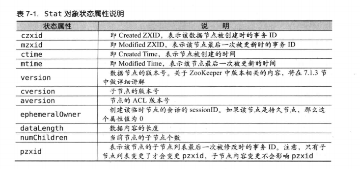
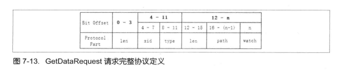
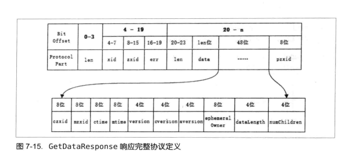
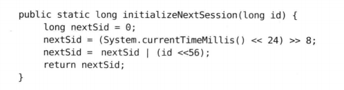
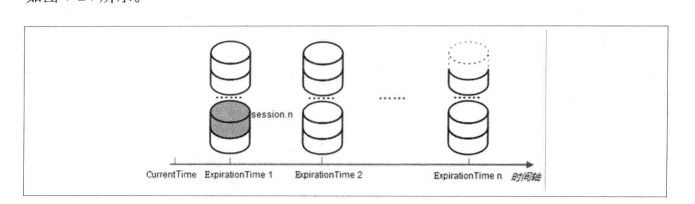
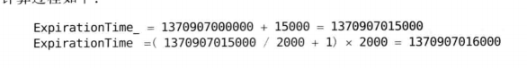

# zookeeper

ZooKeeper为分布式应用提供了高效且可靠的分布式协调服务，提供了诸如统一命名服务、配置管理和分布式锁等分布式的基础服务

ZooKeeper是一个典型的分布式数据一致性的解决方案，分布式应用程序可以基于它实现诸如
* 数据发布/订阅
* 负载均衡
* 命名服务
* 分布式协调/通知
* 集群管理
* Master选举
* 分布式锁
* 分布式队列

适用于以读为主的应用场景

ZooKeeper可以保证如下分布式一致性：
* 顺序一致性 从同一个客户端发起的事务请求，最终会严格的按照发起顺序被应用
* 原子性
* 单一视图 无论客户端连接的是哪个ZooKeeper服务器，其看到的服务端数据模型是一致的
* 可靠性
* 实时性（最终一致性） ZooKeeper仅能保证在一定时间内，客户端最终一定能够从服务端上读取到最新的数据状态
  
## 集群角色

* Leader
* Follower
* Observer

Leader选举过程选定一台机器成为Leader，为客户端提供读和写服务
Follower和Observer提供读服务
Observer不参与Leader选举过程，也不参与写操作的“过半写成功”策略，可以在不影响写性能的情况下提升集群的读性能

## Paxos的局限性

### 恶性竞争锁  
两个Proposer提出完全相同的议案, 并争取多数议员支持. 我们刚才说过, 一般系统设计类, 议员的策略很简单, 就是谁号大听谁的. 于是这两个Proposer就不断的提升自己的议案编号, 议员不断的接收到递增的Prepare请求, 并立即拒绝上一个. 导致两个Proposer都无法获得绝对多数支持, 从而谁都通不过信息.

### 同时发起的议案不保序  
一个议长Proposer同时发起多个不同的议案, 然后发起后他就去吃饭了. 接班的议长并不知道刚刚发起的多个议案相互之间的先后顺序, 就有可能导致这些议案的通过顺序不同. 如果这些议案恰好不是正交的, 那么最后会得出不同的结论.

例如议长先后发起的两个语义正交的议案, 酒醉驾车违法, 家暴违法. 然后去吃饭了, 新来的哥们主持后边的会议是没有问题的.

但如果前任议长发起的议案在语义上不正交, 必须保序. 比如 F91必须在WCS上穿女装, F91必须在WCS上换一次衣服. 根据继任者的理解不同, 可能F91会先女装,然后换装, 偏离了初衷.

## ZAB协议

ZooKeeper Atomic Broadcast ZooKeeper原子消息广播协议
支持崩溃恢复的原子广播协议

包括两种基本的模式：
* 崩溃恢复
* 消息广播

仅允许一个Leader服务器进行事务请求的处理  
Leader服务器在接收到客户端的事务请求后，会生成对应的事务提案并发起一轮广播协议  
如果集群中的其他机器接收到客户端的事务请求，那么这些非Leader服务器会首先将这个事务请求转发给Leader服务器

ZAB类似二阶段提交，在ZAB协议的二阶段提交过程中，移出来终端逻辑，过半的Follower服务器已经反馈ACK之后就开始提交事务Proposal，不需要等待集群中所有的Follower服务器都反馈响应

ZAB协议和Paxos算法的本质区别在于，两者的设计目标不太一样。  
ZAB协议主要用于构建一个**分布式的高可用数据主备系统**。例如ZooKeeper，
而Paxos算法则是用于构建一个**分布式的一致性状态机系统**。


### Atomic broadcast 原子广播
系统里所有节点都以同样的顺序接受到消息，
1. Validity: if a correct participant broadcasts a message, then all correct participants will eventually receive it.
2. Uniform Agreement: if one correct participant receives a message, then all correct participants will eventually receive that message.
3. Uniform Integrity: a message is received by each participant at most once, and only if it was previously broadcast.
4. Uniform Total Order: the messages are totally ordered in the mathematical sense; that is, if any correct participant receives message 1 first and message 2 second, then every other correct participant must receive message 1 before message 2.

## zab协议描述

zab里分三种状态 election  following leading

分三个阶段 discovery synchronization broadcast

discovery阶段：
*  leader 如何确定最大的epoch？
*  leader如何得到初始的history？ 同步数据机制

sync阶段：
* follower如何同步数据？同步数据机制
* 新加入的follower如何同步数据？ membership

broadcast阶段：
* commit阶段做了什么？
* commit和触发watch是什么顺序？

zab协议必须能够保证如果一个状态变更已经被处理了，那么所有其依赖的状态变更都应该已经被提前处理掉了

## Leader选举算法： 

### ZXID

ZXID 是一个64位的数字，低32位可以看做是一个简单的单调递增计数器，高32位代表Leader周期epoch的编号

保证选举出来的Leader服务器拥有集群中所有机器最高编号（即ZXID最大）的事务Proposal，就能保证他一定具有所有已经提交的提案。

能够确保提交已经被Leader提交的事务Proposal，同时丢弃已经被调过的事务Proposal  


## zookeeper服务器之间连接规则

只允许SID大的服务器主动和其他服务器建立连接

## 部署运维

根据配置的节点数量，分为单机模式和集群模式

ZooKeeper水平扩容要进行整个集群的重启：整体重启或逐台重启

容灾：三机房部署，保证一个机房挂了，剩下两个机房还能正常工作

## zab 如何恢复数据


## Q&A
* watch通知前又更新了，读到的是哪个版本？  
    读到最新版本，中间的变化不重要

* 当一个follower连不上leader时，他进入了election状态，其他主机呢？

* sync的机制


## 代码实现

### 客户端

#### 原生API
* 创建会话：ZooKeeper(String connectString, int sessionTimeout, Watcher watcher);  
    总是异步的  
    可以通过使用sessionId和sessionPasswd复用已有的会话
    可以通过指定canBeReadOnly进入只读模式

以下接口都有同步异步两种定义
* 创建节点：create  
    
* 删除节点： delete  
    通过指定版本保证事务性  
    只允许删除叶子节点，如果一个节点还有子节点的话，无法直接删除

* 读取子节点列表：getChildren
    子节点列表变化时，会发送NodeChildrenChanged事件通知

* 读取节点数据：getData
    节点数据变化时，会发送NodeDataChanged事件通知

    数据节点本身也有状态信息  

* 更新数据：setData
    通过指定节点的数据版本，保证事务性

* 检测节点是否存在：exists
    注册的watcher，监听三类事件：
    * 节点被创建
    * 节点被删除
    * 节点被更新
    
##### java实现
* ClientCnxo: 复制维护客户端和服务端之间的网络连接并进行一系列网络通信，底层使用NIO，可以自己实现（-Dzookeeper.clientCnxnSocket=org.apache.zookeeper.ClientCnxnSocketNIo）
  * Packet：封装了请求和响应，提供序列号和反序列化接口
  * outgoingQueue：客户端的请求发送队列
  * pendingQueue：服务端响应的的等待队列
  * SendThread：网络收发数据
  * EventThread：业务逻辑，包括处理watch回调


#### ZkClient

watch的通知机制是不可靠的，zkServer不会保证通知的可靠抵达。虽然zkclient与zkServer端是会有心跳机制保持链接，但是如果通知过程中断开，即时重新建立连接后，watch的状态是不会恢复。

#### Curator

Fluent风格的api


### 服务端

#### 系统模型
* 数据模型：
  * 树
  * 事务ID  ZXID 64位数字
* 节点特性
  * 持久节点
  * 持久顺序节点
  * 临时节点
  * 临时顺序节点
    节点特性
    
* 版本 保证分布式数据原子性操作
* Watcher  数据变更的通知
    特性：
    * 一次性
    * 客户端串行执行
    * 轻量  内容只包括通知状态、事件类型、节点路径
* ACL

#### 序列化

序列化组件：Jute 

#### 通讯协议

二进制bit，
* 请求包含len、请求头、请求体
* 响应包含len、响应头、响应体






ConnectRequest:会话创建

```
package org.apache.zookeeper.proto;

import org.apache.jute.*;
public class ConnectRequest implements Record {
  private int protocolVersion;
  private long lastZxidSeen;
  private int timeOut;
  private long sessionId;
  private byte[] passwd;
  ...
```
    里面带有这个客户端最后一次看到的zxid值，服务器如果本身的zxid小于它，会拒绝连接，保证客户端侧不会看到旧数据
  

#### 会话

##### sessionID

每次客户端发起会话创建请求时，服务端分配一个全局唯一的sessionId



参数id是服务器标准SID，算法跟时间相关，保证在一个epoch期间sessionId递增,  

各个服务器单独计算，但仍全局唯一

##### 会话管理：分桶策略






ZooKeeper将所有的会话分配到了不同的区块中，分配的依据是每个会话的下次超时时间点（ExpirationTime），是ExpriationInterval的倍数

* 会话激活
  
只要客户端向服务端发送请求，包括读写或者心跳，就回触发一次会话激活  

客户端发现sessionTimeout/3时间内未和服务器有过任何通讯，主动佛拿过去一个PING请求
 
客户端定期发送心跳保持会话有效性，
服务端进行会话激活流程：
    * 建议该会话是否已经被关闭
    * 计算该会话新的超时时间
    * 定位该会话当前的区块
    * 迁移会话： 根据新的超时时间迁移到对应的桶里

* 会话超时检测
单独一个线程专门做会话超时检测：依次对会话桶中剩下的会话进行清理  

在分桶策略中，将ExpriationInterval的倍数作为时间点来分布会话，超时检查线程在指定的时间点上进行检查，批量清理，效率高

* 重连
1. 在session timeout之内连接成功 无缝迁移
2. 在session timeout之内没有重新连接
    zookeeper集群发现任务会话已经结束，清除和这个session有关的所有数据，包括临时节点和注册的监视点Watcher。在session超时之后，如果client重新连接上了zookeeper集群，zookeeper会发出session expired异常，且不会重建session，也就是不会重建临时数据和watcher。

连接事件：
* 连接断开：connecttion_loss  
* 会话失效：session_expired  
* 会话转移：session_moved    触发SessionMovedException异常

#### Leader选举
* 基于TCP版本的FastLeaderElection选举算法
* 投票信息（myid,ZXID)  
* 最终数据最新的服务器被选为leader  
* 一个机器收到超过半数的相同的投票，那么这个投票对应的SID机器即为Leader
* 服务器状态：
  * looking
  * following
  * leading
  * observing

#### 事务处理
每一个事务请求都需要集群中过半机器投票认可才能被真正应用到ZooKeeper的内存数据库中，这个投票和统计的过程叫Proposal流程

**Proposal流程**
1. 发起投票 检查ZXID是否可用，用尽了的话触发xidrolloverexception异常，重新选举
2. 生成提议Proposal 将请求头、事务体、ZXID和请求本身序列化到Proposal对象中
3. 广播提议  发送给所有Follower
4. 收集投票  follower收到Leader的提议后，进入Sync流程进行事务日志的记录，完成后发送ACK，Leader收到过半机器的投票，就认为提议通过，进入Commit阶段
5. 将请求放入 toBeApplied队列 提议被提交前，先放入队列里
6. 广播Commit消息 向Follower和Observer广播提交消息，前者只带zxid，后者要带提议内容
   
**Commit流程**
1. 将请求放入queuedRequests队列
2. 确认过半投票认可，放入commitedRequests队列
3. commit流程开始，将请求放入toProcess队列
4. 事务应用 内存数据库变更刷到磁盘上

#### 内存数据库

数据存储分为两部分：内存数据存储和磁盘数据存储

实现 **org.apache.zookeeper.server.ZKDatabase**

* dataDir存储快照
* dataLogDir存储事务日志

初始化时先加载数据快照，然后应用事务日志，恢复数据

#### 数据同步
* 获取learner状态 learner发送ACKEPOCK数据包，包含currentEpoch和lastZxid
* leader从内存数据库里取出提议缓存队列，初始化三个值
  * peerLastZxid
  * minCommittedLog
  * macCommittedLog
* 四种数据同步方式，同步也是2pc的过程
  * 直接差异化同步 DIFF同步
  * 先回滚再差异化同步 TRUNC+DIFF同步
  * 仅回滚同步 TRUNC同步
  * 全量同步 SNAP同步
